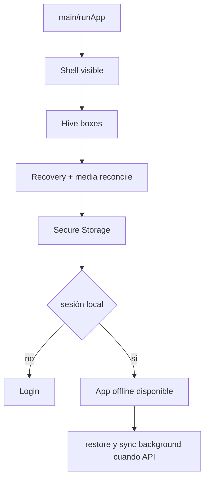
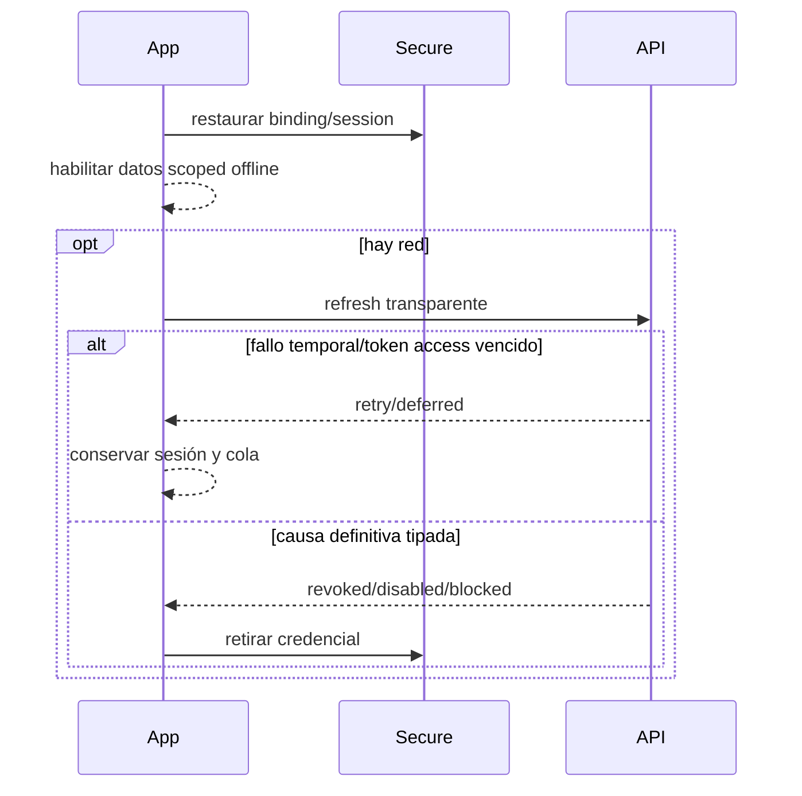
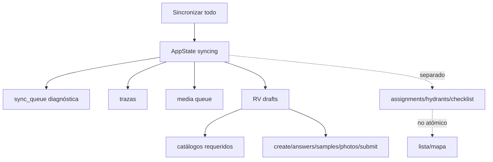
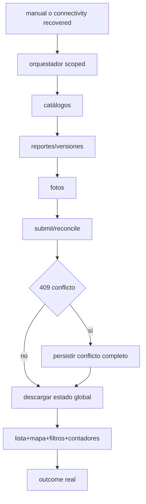
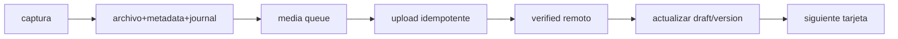
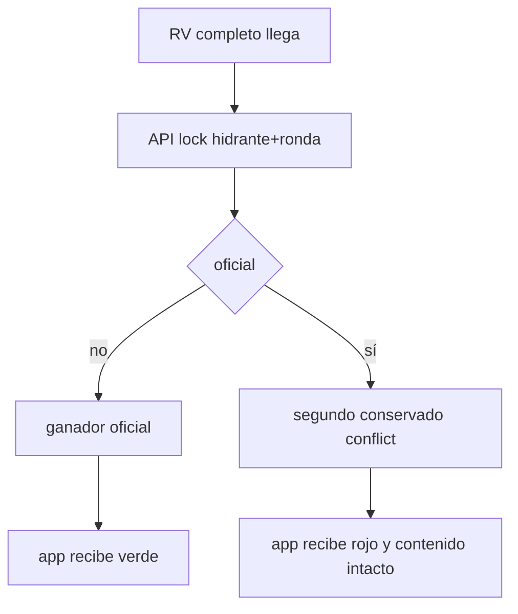
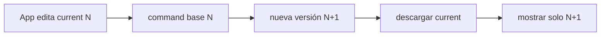
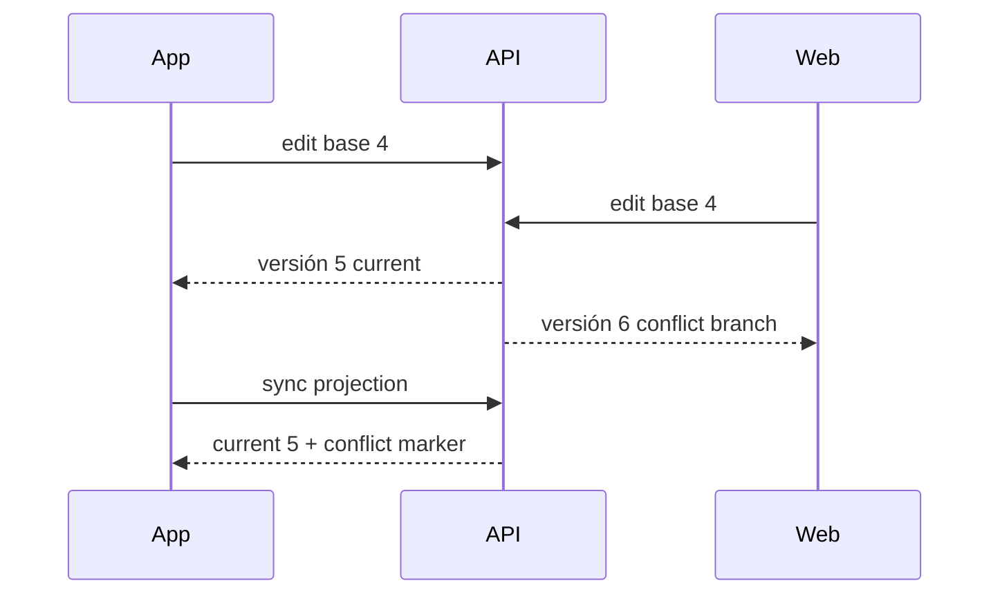
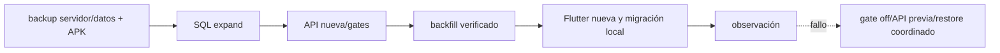

# Actualización mayor RV — diagnóstico técnico y plan maestro Flutter

Fecha de corte: 2026-08-01. Rama: `plan/rv-major-update-analysis`. Documento coordinado con el plan API homónimo. No contiene cambios funcionales.

## 1. Resumen ejecutivo y resumen coordinado

Flutter ya posee bases sólidas: bootstrap visible y recuperable, Hive CE, Secure Storage, alcance de datos por usuario/cuenta/ambiente, journal/recovery, colas persistentes, fotos íntegras, coordinador RV y pruebas amplias. El cambio mayor no es cosmético: el estado local/remoto y la navegación están repartidos entre `AppState`, repositorios legacy y RV; el contrato actual de sesión y reporte no puede representar sesión permanente, versiones ni conflictos preservados.

Conclusiones compartidas con API:

- API y app permiten reemplazo A→B en el mismo dispositivo; debe prohibirse hasta logout válido.
- La app conserva credenciales ante fallas de transporte, pero borra Secure Storage ante 401/403 definitivo y muestra mensajes de expiración; el objetivo exige distinguir revocación explícita de token vencido/servidor caído.
- El reporte RV local sí tiene revisión/estados y datos persistentes, pero el servidor sobrescribe hijos; no existe sincronización bidireccional completa de historial.
- “Sincronizar todo” no es un único commit: procesa diagnósticos/trazas/fotos y RV por caminos diferentes; algunos catálogos/refresh de hidrantes ocurren fuera del resultado. El indicador puede declarar sincronizado con trazas excluidas y no garantiza que lista/mapa reflejen el servidor.
- El mapa actual solo muestra azul/verde; el estado remoto llega desde API, mientras pendientes locales se superponen de forma parcial. Lista y mapa necesitan una proyección común.

Riesgo Flutter global: **alto** en migración/sync/identidad, **medio** en UX y rendimiento.

## 2. Estado actual real y arquitectura

`main` renderiza inmediatamente `AppBootstrapShell`; bootstrap asíncrono tiene timeout 30 s, estado textual, error y reintento, por lo que el código actual evita pantalla negra salvo fallo nativo previo a `runApp` o bloqueo del engine/plugin. Flutter/Dart: SDK Dart `^3.12.2`, app `0.2.4+17` (no cambiar). Arquitectura pragmática por features: `app` (router/bootstrap), `core`, `domain`, `data/local`, `features/*`; Provider con `AppState`; GoRouter StatefulShell; Dio; Hive JSON versionado; Secure Storage; SharedPreferences; filesystem para fotos.

Rama inicial `main` limpia y alineada con remoto; se ejecutó fetch y se creó la rama. `flutter pub get` no cambió el lock rastreado.

## 3. Inventario de features

| Feature | Implementación real | Impacto |
|---|---|---|
| auth | login técnico sin password, restore/current/refresh/logout | rediseñar binding permanente |
| home/profile | métricas, filtros, acceso sync/integridad | navegación a raíz y estados globales |
| hydrants | caché, sync/paginación, exact/partial, detalle/nuevo | ocultar ubicación y revisados normales |
| map | carga región/radio, caché, clusters, selección | cinco estados/leyenda/reportes ajenos |
| checklist/RV | dinámico, borrador, steps, summary, validator | nuevas reglas/campos/exit UX |
| catalogs | marcas/diámetros offline | agregar rangos; marca ilegible |
| media | captura fiable, hashes, work queue, reconcile | generales 0..5 y versión |
| sync | página manual, AppState, coordinator RV | orquestador único y outcome verificable |
| recovery/integrity | journal, quarantine, revision resolver | reutilizar para migración local |
| visual/functional legacy | modelos/pantallas adicionales | evitar mezclar RF con exclusividad RV |

## 4. Flujo de bootstrap e inicio

1. `runApp`; frame inicial medido.
2. Locale, `Hive.initFlutter`, apertura secuencial de 31 boxes.
3. recovery lightweight, auditoría y reconciliación media.
4. SharedPreferences, package/config, Secure Storage, Dio y repositorios.
5. seed catálogo dinámico, construir `AppState`, `initialize`.
6. Se carga caché hidrantes/checklist; se lee sesión segura. Si existe se considera autenticado inmediatamente y `sessionOffline=true`.
7. UI queda disponible; en background inicia monitor y `restore`; después assignments/checklist si API disponible.

Login se muestra si no hay sesión local o redirect de ruta protegida detecta `!authenticated`. Datos quedan bloqueados cuando el scope se limpia antes de aplicar sesión; esto evita fuga, pero una credencial eliminada por refresh 401 deja el estado en memoria hasta que el flujo superior reconcilie. El bootstrap no espera red, correcto para offline. Riesgos de pantalla negra: excepción síncrona anterior al shell, plugin nativo colgado, o frame del motor; los fallos Dart dentro de bootstrap muestran reintento.

## 5. Sesión móvil actual

`FieldSession` conserva tokens, IDs usuario/crew/dispositivo, perfil y registration. `SessionSecureStorage` usa claves versionadas y conserva installationId separada; la escritura es staged para reducir corrupción. `FieldSessionRepository.restore` consulta current, intenta refresh ante 401 y conserva la sesión en error de transporte; 401 definitivo limpia. Dio agrega bearer, serializa refresh concurrente, reintenta una request, conserva credenciales en fallas temporales y limpia ante 401/403 de refresh. GET tiene un reintento corto de 250 ms. Logout intenta cerrar servidor; offline marca `pending_field_session_end`, luego limpia credenciales, scope y memoria, pero conserva Hive/fotos.

`authenticated` significa sesión presente, no access vigente ni restauración servidor. `sessionOffline` enciende banner; `editingRestricted` depende de actualización obligatoria, no sesión. Map/hidrantes pueden usar caché offline; las operaciones remotas traducen auth a mensajes. Cambio de usuario se permite: una autenticación B exitosa reemplaza tokens, cancela requests de A y cambia scope; datos A quedan físicamente conservados e inaccesibles.

Inventario de mensajes/decisiones auth:

| Lugar | Mensaje/decisión |
|---|---|
| `api_exception.dart` | `Tu sesión expiró.`; al enviar: `El reporte está guardado... Inicia sesión nuevamente...` |
| `inspection_sync_coordinator.dart` | estado `requiresAuthentication` y mismo mensaje de reporte |
| `map_page.dart` | `El acceso debe restaurarse para actualizar esta zona.` |
| `main_shell.dart` | `Sesión sin verificar — modo sin conexión` |
| router | cualquier ruta protegida sin `_session` → `/login` |
| AppState restore | error temporal conserva sesión y activa offline |
| tests/auth UI | consolidan semántica actual 401/403 |

Objetivo: sesión local nunca se elimina por expiración normal, falta de red o 5xx. API debe devolver códigos de revocación explícitos; solo `manual_logout`, `admin_revoked`, `user_disabled`, `device_blocked` cierran. Mantener scope local cerrado cuando otro usuario intenta entrar y API responde 409; no tocar datos ni tokens de A. Después de logout válido B recibe su scope y descarga historial completo.

## 6. Almacenamiento local y aislamiento

| Almacenamiento | Datos | Alcance | Conservación | Migración necesaria |
|---|---|---|---|---|
| Secure Storage | FieldSession/tokens, installationId, staging | instalación/usuario | sesión se limpia logout/401; installation se conserva | contrato binding v2 sin borrar v1 hasta confirmar |
| SharedPreferences | flags como pending end, config liviana | instalación | persiste actualización/logout | versionar flags por ambiente/usuario |
| `trace_events`, `synced_trace_ids` | trazas | owner user | conserva | scope/migrar legacy |
| `sync_queue`, `media_sync_queue`, `media_work_queue_v1` | operaciones/fotos | owner/dependencias | conserva | outcome y version IDs |
| `visual_inspections_v1`, `active_inspection_index_v1` | documentos/índice RV | scope user/account/env | conserva y oculta a otro | schema v2 + current/server versions |
| `inspection_photos_v1` + filesystem | metadatos/evidencia | capturedBy user | no se borra; reconcile | kind/description/version/general index |
| `local_hydrants_v1` | catálogo/asignaciones | scope | conserva | estado global/changedAt/report ref |
| `rv_checklist_cache_v1` | checklist | ambiente | conserva | nueva versión y legacy fallback |
| `rv_dynamic_catalogs_v1` | marcas/diámetros pendientes | user/global | conserva | pressure ranges + unreadable brand |
| `damage_records_v1`, configurations y galerías | evidencia/UI | reporte/user | conserva | ligar a versión |
| boxes functional/measurement/instruments/tests/results | RF | usuario/reporte | conserva | ninguna exclusividad RV |
| journal/quarantine/revisions/integrity | recuperación/historial local | instalación+owner | conserva | registrar migraciones |

La actualización normal conserva app documents/Hive/Secure/Prefs; desinstalación o clear-data no. Logout actual no limpia boxes ni fotos: cambia acceso scope. `_resetActiveSessionState` limpia colecciones en memoria. Datos legacy sin owner permanecen conservados pero pueden quedar inaccesibles/auditados. La migración debe ser copy-on-write, idempotente, con marker solo al confirmar, quarantine sin borrar y backup lógico de JSON; no llamar `Hive.deleteBoxFromDisk` ni clear masivo.

Para cargar historial del usuario: endpoint paginado después de binding, upsert por report/version, descargar metadatos/thumbnail bajo demanda, reconciliar con locales pendientes por client ID, nunca sustituir un borrador no sincronizado.

## 7. Sincronización actual

`InspectionSyncCoordinator` encadena catálogo pendiente → create → answers/parcel valves → location/signal → fotos → reconcile → submit → verify. Guarda tras cada paso y usa client IDs/Idempotency-Key. Backoff del draft: 5/15/45 s, no loop agresivo. Reinicio reanuda desde Hive. Submit ambiguo consulta inspección. 409 se traduce como conflicto genérico/syncError; no hay entidad conflictiva completa. Fotos pueden llegar después del formulario; submit espera las siete verificadas.

AppState además mantiene `sync_queue` diagnóstica, media, trazas y sincronización de assignments/hidrantes/checklist. Al recuperar conectividad, `_onConnectivityChanged` hoy actualiza banderas; parte de las sincronizaciones se dispara en inicialización/login, no existe garantía única de auto-sync RV para cada transición de red.

### Análisis de “Sincronizar todo”

Aparece en `SyncPage`, accesible desde acciones de home/perfil/shell según rutas; el botón invoca coordinación a través de AppState. Incluye cola diagnóstica accesible, trazas pendientes, fotos del usuario y drafts RV mediante su coordinador. Catálogos dinámicos se sincronizan como dependencia dentro del flujo RV, no como fase global exhaustiva; checklist/hidrantes/assignments se refrescan por métodos separados. RF y todos sus agregados no tienen un transport remoto equivalente completo. Puede quedarse visualmente esperando una future/entidad lenta; no hay cancelación por entidad ni watchdog global. `allSynchronized` cuenta diagnósticos+fotos+errores, pero omite `pendingTrace` y estado draft RV en su getter base, por lo que el estado visual puede no corresponder con el resultado real. Lista/mapa no quedan necesariamente refrescados atómicamente tras cada submit.

Objetivo: orquestador único, mutex por usuario, DAG explícito, outcome por entidad, backoff con jitter, auth deferred no logout, conflictos conservados, refresh final obligatorio de proyección global y notify inmediato. Manual y automático llaman la misma operación. Incluir reportes/versiones, fotos, catálogos, trazas y refresh de hidrantes; declarar RF no soportado hasta endpoint.

## 8. Estados actuales y objetivo

Estados locales RV incluyen draft/inProgress/ready/pending/submitting/submitted/syncError/requiresAuthentication/cancelled (nombres exactos centralizados en `rv_sync_state.dart`/`rv_draft.dart`); partes usan pending/syncing/synced/error y fotos pending/uploading/verified/error. Remoto usa draft/in_progress/pending_sync/submitted/validated/rejected/cancelled.

| Estado actual | Significado actual | Estado objetivo | Grupo visible | Transiciones permitidas |
|---|---|---|---|---|
| draft/inProgress | captura local | draft/in_progress | Ámbar | editar/autoguardar/finalizar |
| ready/pending/submitting | final/local o envío parcial | completed_local/syncing | Ámbar | sync/backoff |
| submitted | servidor confirmó | pending_validation | Verde si oficial+fotos | versionar/validar/devolver |
| validated | remoto aprobado | validated | Verde | notas/fotos generales como versión |
| rejected | devuelto | returned | Rojo | nueva versión |
| syncError | fallo genérico | retryable_error o conflict | ámbar/rojo | retry/resolver |
| requiresAuthentication | 401/403 | auth_deferred o revoked tipado | Ámbar/login solo si definitivo | refresh/revocar |
| cancelled | cancelado app | borrador conservado | historial | resolución web |
| no disponible/inactivo | parcial | unavailable | Gris | solo lectura |

## 9. Navegación actual y bugs Home/Hidrantes

Router: `/`, `/login`; shell roots `/home`, `/hydrants`, `/map`, `/profile`; nested `/hydrants/new`, `/:id`, `/:id/inspection/:type`, summary, gallery; profile manual/integrity; modal `/sync`. StatefulShell conserva stacks. `MainShell.navigate` usa `goBranch(index, initialLocation:false)`: al tocar Hidrantes/Home vuelve al último subroute de esa rama, por eso puede reaparecer detalle/resumen/inspección. La misma lógica afecta Home si su branch obtiene rutas futuras/stack. Además, rutas/acciones de detalle reanudan active inspection por índice y filtros Home publican request hacia Hidrantes.

Corrección objetivo: taps explícitos de Home/Hidrantes usan `goBranch(..., initialLocation:true)` o pop-to-root controlado; reanudación solo desde CTA explícito. Antes de abandonar formulario, un guard común autoguarda y confirma. Hoy `RvReviewNavigation` ya confirma back desde paso 1 y tests cubren back físico; el shell/swipes/rutas directas y CTAs deben pasar por el mismo guard.

Inventario de salidas: back appbar/físico, swipe de pasos, taps bottom nav Home/Hidrantes/Mapa/Perfil, links a summary/gallery/sync, submit success a Home, seleccionar otro hidrante, redirect auth/update, lifecycle/close. `Cancelar inspección` existe en flujo/coordinator/UI y debe eliminarse; botones “Cancelar” de diálogos de marca/válvula solo cierran diálogo y no equivalen a cancelar inspección.

## 10. Lista de hidrantes

Fuente: `HydrantRepository` combina caché, `/hydrants/sync` y fallback paginado; `AppState` mantiene catálogo y asignados. Proyección/filtros centralizados en `HydrantQueryProjection`; búsqueda cliente y endpoint exacto/partial. Cards muestran account, locality/municipality y fecha/revisión según modelo. La API personaliza `lastInspection` al usuario.

Cambios: modelo agrega `globalRvState`, `lastStatusChangedAt`, `currentReportId`, `reviewedByMe`; lista normal filtra solo available y búsqueda parcial sobre ese conjunto; exacta consulta servidor/cache exact match aun revisado, abre `ReportReadOnlyPage`; ocultar localidad/municipio en cards, detalle, sheet mapa, sugerencias y accesibilidad (conservar en DTO/cache). Historial técnico muestra propios todos los estados. Reporte ajeno exige conexión.

## 11. Mapa

`MapPage` descarga radio/viewport paginado, conserva caché, hace índice espacial/clusters y sheet; tiles CARTO requieren red. Leyenda actual: azul RV pendiente y verde terminada. `_HydrantMarker` decide por estado del modelo; region refresh maneja auth/offline. API no entrega aún los cinco estados canónicos.

Objetivo común de prioridad: rojo conflict/returned > ámbar local draft/completed/syncing > gris inactive/unavailable > verde server official complete + required photos verified > azul available. Superposición local solo para el usuario/dispositivo; al sync descargar global y reemplazar inmediatamente. Leyenda de cinco colores. Sheet oculta localidad/municipio y abre nuevo formulario si azul o reporte lectura si revisado. Reporte ajeno requiere conexión.

## 12. Formulario RV

Checklist dinámico renderiza tipos boolean/text/number/select/multiselect/photo/brand/diameter y editor parcelario; validator evalúa dependencias, ubicación/señal y siete slots. Summary calcula pendientes; existen keys, `Scrollable.ensureVisible`, FocusNode/target y tests de navegación, pero debe unificarse salto+focus+highlight 3 s para todo tipo. Fotos no avanzan de forma uniforme a la siguiente tarjeta.

Hallazgos semánticos:

- “Piloto” aparece en marcas/tipo `PILOT`, editor parcelario (`hasPilot`, `pilotBrand`), catálogos y componentes visuales. La nueva pregunta debe ser un boolean obligatorio independiente `pilots_connected`/código definitivo del checklist, sin explicación; no confundir presencia/marca.
- La etiqueta `Tiene elemento filtrante` corresponde al código real `filter_element`, tipo actual `boolean`, sección `filtro`; se comprobó en `database/01_revision_visual_starter_SQL2014.sql`. La puntuación final se aporta desde el checklist, no desde un literal Flutter.
- Campos Marca: checklist genérico usa `_BrandField` (selector/buscador + registrar offline); parcel valves tienen válvula, solenoide, piloto, manómetro con el mismo selector tipado; visual/functional legacy contienen campos texto (`TextFormField`) y modelos `brandText`. “Aplica a todos” exige inventario/migración de ambos mundos o limitar formalmente a RV.
- Rangos de manómetro actuales están como texto libre en componentes/instrumentos (`measurementRange`). Los códigos checklist reales `sustaining_gauge_range`, `regulating_gauge_range`, `filter_gauge_before_range`, `filter_gauge_after_range` y `parcel_gauge_range` son tipo `text`. No existe selector global; debe reemplazarse en RV por catálogo mínimo/máximo/unidad, preservando legacy como `No capturado`/texto histórico.
- “Marca ilegible” debe ser opción especial no fabricante: reason obligatorio >=10, foto opcional, en todos `_BrandField` y equivalentes RV.
- Elemento filtrante pasa Sí/No/Indefinido con motivo >=10; requiere nuevo tipo tri-state o select y validación condicional.
- Eliminar cancelar inspección; conservar autoguardado y confirmación de salida.

## 13. Fotografías

`ReliablePhotoService` normaliza/persiste metadata y work queue; `InspectionPhoto` guarda paths/hashes/owner/status; reconciliación no marca verified sin evidencia remota. RV tiene siete slots requeridos con múltiples refs, retry y reconcile. Galería existe y puede reutilizarse, pero contenido remoto actual solo creador.

Agregar `generalPhotos` 0..5 a draft/version, description nullable, order/index, delete/replace soft, mismo SHA-256. UI avanza tras captura exitosa a siguiente card y permite fullscreen/zoom. No exponer share/download ni `Share` intent; cache privado es necesario para mostrar, así que “sin descarga” significa sin acción exportable, no imposibilidad técnica absoluta.

## 14. Catálogos

`DynamicCatalogRepository` cachea/crea/sincroniza marcas/diámetros por client UUID y tipos. Agregar `PressureRangeOption` con min/max decimal, unit enum psi/bar, normalized key, active/source/creator/clientId/sync state. Crear offline y resolver alias server. Nunca convertir psi↔bar para deduplicar. Checklist/DTO debe referir catalog ID y snapshot display para historia.

## 15. Pantalla de reporte propuesta

Hay piezas reutilizables: `RvSummaryPage` (revisión editable), `PhotoGalleryPage`, componentes visuales con modo lectura y resolvers de revisión. No existe una pantalla integral respaldada por endpoint para reporte propio/ajeno con versión vigente, respuestas, fotos e historial. Crear feature `features/reports/` con `ReportRepository`, DTO `ReportSnapshot/ReportAnswer/ReportPhoto/ReportVersionRef`, cache solo de propios y `ReportReadOnlyPage`. Reusar renderers en modo explícito readOnly, no controller editable. Móvil muestra solo current; historial completo queda web. Entrada desde mapa, exacta e historial.

## 16. Migraciones Hive/locales y conservación

1. Detectar schema/version por documento, sin cambiar box original.
2. Copiar a documentos v2 o envelope nuevo: owner scope, logicalReportId, server/current/baseVersion IDs, round, global state, conflict payload, general photos/ranges/new answers.
3. Legacy faltante queda null y renderer dice `No capturado`; validez legacy no se recalcula con reglas nuevas.
4. Reescribir índices en staging; verificar lectura/conteos/paths/hashes; marker commit.
5. En error, usar v1 y quarantine de copia; nunca borrar v1/fotos.
6. Migrar colas para dependencias/version IDs; clientInspectionId se conserva.
7. Al primer login post-update reconciliar local con historial server por owner/client ID.

Riesgos: falta owner legacy, paths externos/temporales, JSON corrupto, app muerta a mitad, poca capacidad, cambio de user durante migración. Mitigar con mutex, espacio previo, journal y pruebas kill/restart.

## 17. Matriz de impacto

| Requisito | SQL | API | Flutter | Plataforma futura | Riesgo | Etapa |
|---|---|---|---|---|---|---|
| sesión permanente | alto | alto | alto | revocar/bloquear | crítico | 1 |
| exclusividad/estado | alto | alto | medio | rondas | crítico | 2 |
| versiones/conflictos | alto | alto | alto | resolver/historia | crítico | 3 |
| reporte lectura | medio | alto | alto | historia | alto | 4–5 |
| rangos/reglas | medio | medio | alto | catálogo | medio | 6–9 |
| fotos generales | medio | alto | alto | revisar | alto | 10 |
| resumen/navegación/lista/mapa | bajo | medio | alto | bajo | medio | 11–14 |
| sync total | medio | alto | alto | observar | alto | 15 |
| migración datos | alto | medio | alto | verificar | crítico | 16 |

## 18. Matriz de endpoints móviles

| Método | Ruta | Uso actual | Cambio necesario | Compatibilidad | Pruebas |
|---|---|---|---|---|---|
| POST | `/field-sessions/start` | login/reemplazo | mobile binding no replace | ruptura | 409/scope |
| POST | `/field-sessions/refresh` | rotación | códigos definitivos | ruptura | offline/reuse |
| GET | `/field-sessions/current` | restore | `/mobile-sessions/me` | ruptura | boot |
| GET | `/hydrants/sync`, `/hydrants`, `/map` | catálogos/estado parcial | global status/changedAt | DTO v2 | cache/map |
| GET | `/hydrants/search` | partial/exact | exact incluye revisados, partial excluye | ruptura | teclado/case |
| POST/PUT | `/inspections*` | crear/overwrite | reports/version commands | ruptura | replay/conflict |
| POST/GET/DELETE | `/inspections/:id/photos*` | evidencia creador | version/general/read ACL | ampliar | 0..5/hash |
| GET/POST | `/catalogs/*` | marcas/diámetros | pressure ranges | ampliar | offline aliases |
| GET | `/reports/:id` (nuevo) | no existe | current snapshot | nuevo | propio/ajeno |

## 19. Matriz de tablas relevantes

| Tabla | Uso actual | Cambio previsto | Migración | Riesgo |
|---|---|---|---|---|
| users/devices/work_sessions/refresh_tokens | sesión | binding permanente | backfill | alto |
| inspections/inspection_answers | reporte mutable | aggregate+version snapshots | legacy→v1 | crítico |
| photos | slots inspección | versión/kind/description | reasignar | alto |
| hydrants | catálogo | estado global/changedAt | backfill | medio |
| brands/diameters | catálogo | reglas especiales | seed/aliases | medio |
| pressure_ranges | no existe | catálogo global | nueva | bajo |
| conflicts/rounds | no existe | conflicto/rondas | nuevas | alto |

## 20. Riesgos

- **Seguridad:** dispositivo perdido/refresh robado requiere revocación server; no guardar secretos en Hive; mantener token en Secure Storage; cancelar requests al cambio; no mostrar datos A a B. Sesión indefinida no significa refresh estático.
- **Datos:** actualización nunca limpia; preservar drafts/fotos/colas, migración journaled, snapshots y conflict payload. Tratar huérfanos en quarantine, no borrar.
- **Concurrencia:** dos equipos/offline, client ID reuse, app/web. UI acepta 409 estructurado, muestra rojo y conserva edición local/versiones.
- **Offline:** token vencido/API caída son auth deferred; catálogos pendientes antes de report; cambio usuario bloqueado con pendientes y binding activo; conflicto tardío se aplica al volver.
- **Rendimiento:** ~2,000 hydrants en caché es razonable; usar projections/indexes, debounce, clusters, pagination y thumbnails; historial/reportes ajenos bajo demanda.
- **Despliegue:** app nueva no compatible con API previa; coordinar SQL→API→datos→Flutter, con feature gate/maintenance y APK anterior disponible solo para rollback completo.

## 21. Matriz de pruebas

| Escenario | API | Flutter | Integración | Manual |
|---|---|---|---|---|
| restore sin red/reinicio/token vencido | sí | unit/widget | sí | modo avión |
| A→B sin logout / logout válido | sí | scope/storage | sí | dos cuentas |
| sync all parcial/restart | sí | coordinator | sí | matar proceso |
| primer/segundo RV | carrera | conflict state | sí | dos móviles |
| app/web edición | versions | current only | sí | resolver |
| lista exact/partial | query | widgets | sí | 2,000 |
| mapa cinco estados | DTO | marker/legend | sí | refresh |
| migration v1→v2 | data | repository | sí | update APK |

Unitarias: state reducer, backoff/outcome, normalization ranges, validation rules, precedence marker, serializer legacy, guard navigation. Widgets: login conflict, banners, list visibility, exact report, five legends, pending focus/highlight 3 s, photo next, read-only no share. Integración: bootstrap offline, refresh rotation, resumed queue, conflict payload, history recovery, kill during migration. Manual: lost device/revoke, low disk, corrupt photo, days-late conflict, server 5xx, Wi-Fi/cellular, accessibility/zoom/fullscreen.

## 22. Etapas posteriores

| # | Objetivo / repos | Dependencias / pantallas | Pruebas y aceptación / rollback |
|---|---|---|---|
| 1 | sesión permanente / ambos | auth, Secure, AppState, API binding | cuatro causas de cierre; rollback gate/session adapter |
| 2 | estado/exclusividad / SQL+API+Flutter DTO | hydrants/list/map | un oficial; rollback projection |
| 3 | versiones/conflictos / ambos | drafts/sync/report state | no LWW; rollback dual-read |
| 4 | report endpoints / API | repository contract | current completo/ACL |
| 5 | report screen / Flutter | mapa/exact/history | read-only+zoom; quitar ruta |
| 6 | ranges / ambos | catalog/Hive/form | psi/bar separados; disable feature |
| 7 | unreadable brand / ambos | all RV brand widgets | motivo 10/foto optional |
| 8 | filter undefined / checklist+Flutter | tri-state | validación legacy |
| 9 | pilots connected / checklist+Flutter | boolean | obligatorio/sin explicación |
| 10 | general photos / ambos | draft/gallery/version | 0..5 replace/delete |
| 11 | pending summary / Flutter | focus/keys | focus+highlight 3s |
| 12 | Home/Hydrants / Flutter | shell/router/guard | siempre root, draft saved |
| 13 | list/exact / ambos | projection/report | hide reviewed/locations |
| 14 | map/legend / ambos | marker DTO | five colors immediate |
| 15 | sync all / ambos | unified orchestrator | all entities/outcome true |
| 16 | existing data / SQL+Flutter | migrations | counts/no captured/no loss |
| 17 | integral tests / ambos | 1–16 | matrix pass |
| 18 | deploy/rollback / all | SQL→API→Flutter | smoke and drill |

Cada etapa debe especificar tablas/endpoints/modelos/boxes/pantallas, migración idempotente, acceptance y rollback. Dependencias estrictas: 1 antes de sync; 2–4 antes de 5/13/14; 3 antes de 10/15; 6–10 antes de migración final.

## 23. Diagramas coordinados de dominio

## 24. Validaciones ejecutadas

| Comando | Resultado |
|---|---|
| `flutter pub get` | correcto; 37 paquetes con versiones más nuevas incompatibles, sin cambio solicitado |
| `flutter analyze` | correcto, sin issues |
| `flutter test` | correcto, 249 pruebas aprobadas |

No se ejecutaron integration tests contra API/producción ni pruebas destructivas.

## 25. Preguntas o bloqueos reales

1. “Todos los campos Marca” puede incluir RF/legacy además de RV; las reglas están en el contexto de actualización RV, pero se necesita decisión de alcance antes de modificar campos de reporte funcional.
2. La capacidad de descargar “todos los datos históricos” depende de endpoints nuevos; no puede certificarse hasta etapas 3–4.

Con estos puntos explícitos, Flutter está listo para iniciar Prompt 1 después de repetir la certificación API con Node 22.
