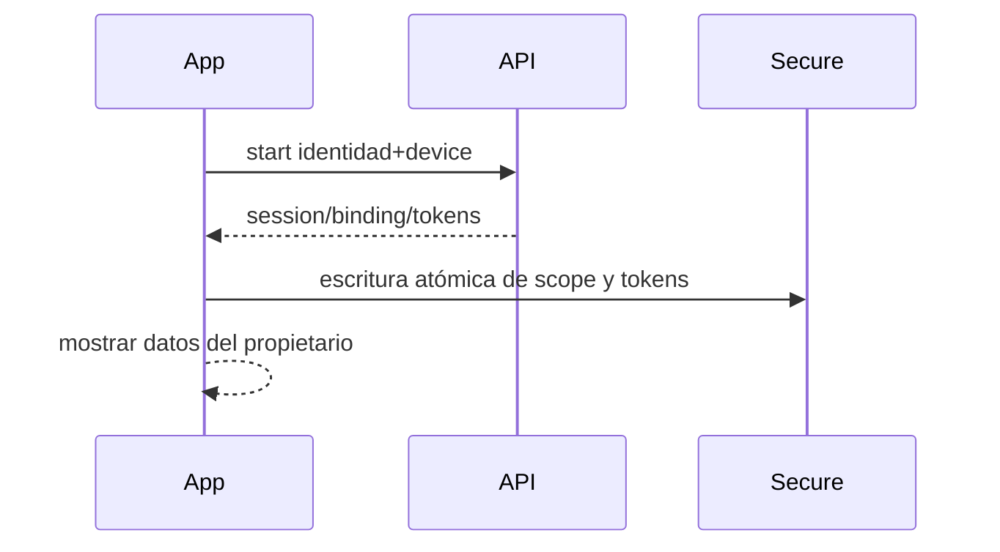
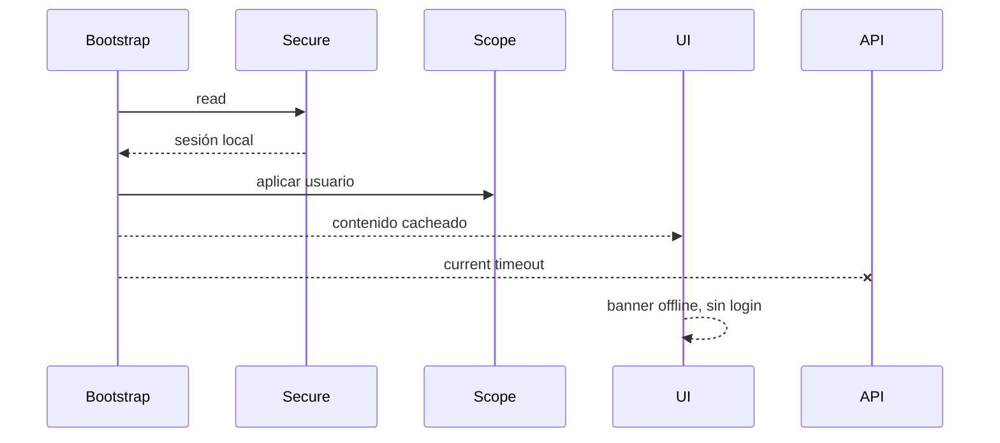
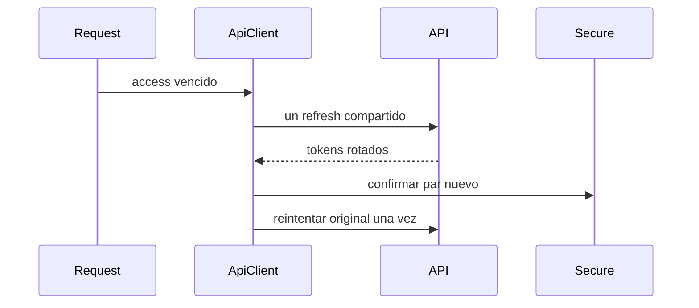
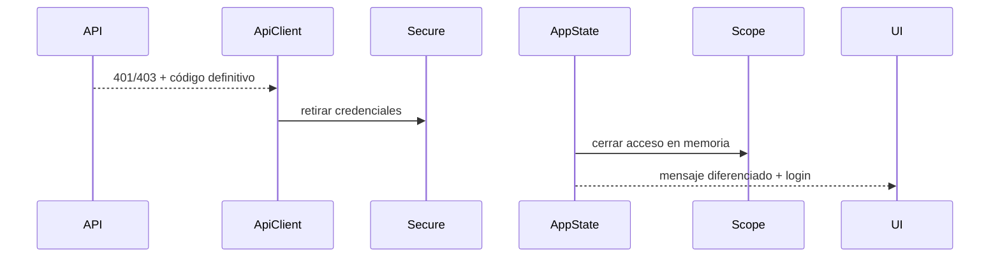
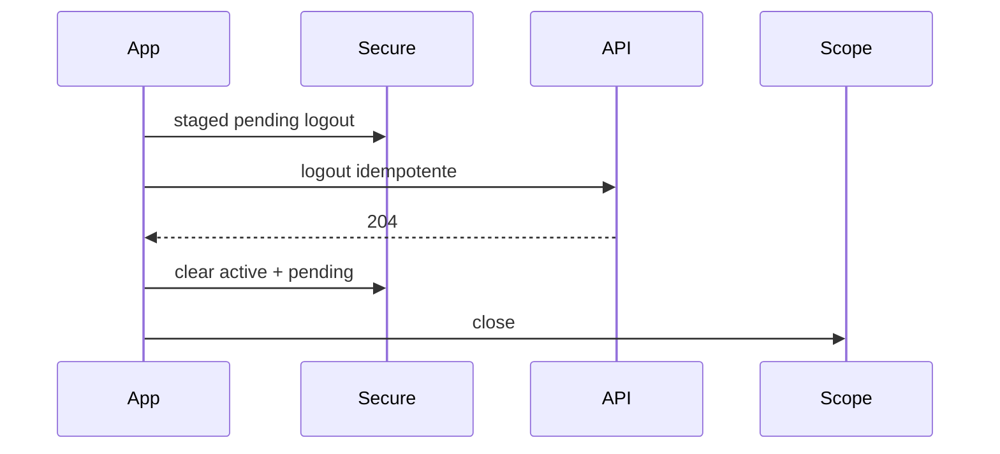
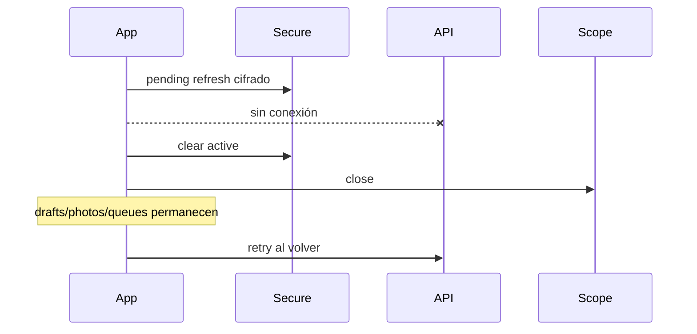
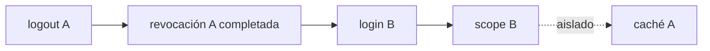
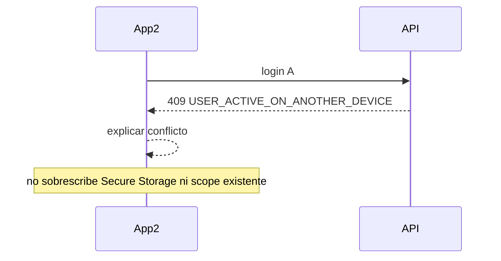

# Etapa 01 — sesión permanente de campo (Flutter)

Fecha: 2026-08-01. Rama: `feature/permanent-field-session`.

## Arquitectura implementada

La identidad se restaura desde Secure Storage durante bootstrap y aplica inmediatamente `LocalDataScope`; mapa, hidrantes, formularios, fotos, historial y colas pueden abrir su caché sin esperar a la API. La verificación remota queda en segundo plano. `FieldSession` acepta `persistentSessionId` y `bindingId` manteniendo lectura legacy cuando no existan.

`ApiClient` conserva un único refresh concurrente, reintenta una vez la solicitud original y solo elimina credenciales si el cuerpo incluye un código definitivo reconocido. Timeout, conexión, 5xx, respuesta inválida y `401/403` genéricos dejan la sesión y el refresh anterior intactos. La cola pasa a error reintentable/offline en fallas temporales, sin `requiresAuthentication` ni mensajes de login.

Logout guarda primero una credencial de revocación pendiente dentro de Secure Storage, cierra la identidad y el scope local inmediatamente y preserva todas las cajas/archivos. Al recuperar red o antes de otro login llama al logout idempotente y elimina la credencial pendiente solo tras confirmación. El cambio A→B aplica un scope distinto; los repositorios ya filtran por propietario/ambiente/cuenta.

## Persistencia y migración

No se borran ni recrean boxes. El modelo nuevo usa campos opcionales y por ello lee sesiones legacy sin migración destructiva. Secure Storage agrega claves de binding/sesión persistente y un sobre separado para logout pendiente. `installation_id` se conserva. SharedPreferences mantiene el indicador visual legacy, pero el secreto pendiente nunca se guarda allí.

Se preservan Hive, Secure Storage no relacionado, SharedPreferences, borradores, fotografías, colas, catálogos, checklist, hidrantes y datos de otros propietarios. No se usa `Hive.deleteBoxFromDisk`, clear global ni borrado de fotos.

## Códigos y mensajes

- `SESSION_REVOKED`: Tu sesión fue revocada por un administrador.
- `USER_INACTIVE`: Tu usuario fue desactivado.
- `DEVICE_BLOCKED`: Este dispositivo fue bloqueado.
- `DEVICE_BINDING_REVOKED`: El acceso de este dispositivo fue revocado.
- `REFRESH_TOKEN_REUSE`: La seguridad de la sesión requiere iniciar nuevamente.
- Cualquier falla temporal: Sin conexión. Puedes continuar trabajando; los cambios se sincronizarán después.

## Flujos

### Login correcto

### Restauración offline

### Refresh

### Revocación

### Logout online

### Logout offline

### Cambio de usuario

### Usuario activo en otro dispositivo

## Pruebas, despliegue y rollback

Unitarias cubren refresh único, red/500, `401` genérico, cinco revocaciones, sesión legacy/nueva, aislamiento y logout offline; widgets existentes cubren bootstrap visible y acceso a caché. Despliegue pendiente: API/migración primero, configurar `FIELD_REFRESH_TOKEN_HOURS=87600`, compilar app y probar modo avión/reinicio/dos usuarios/dos dispositivos en ambiente. Rollback de app conserva todos los documentos; si el contrato API se revierte, deshabilitar distribución nueva y coordinar API/SQL. Riesgos: credencial pendiente puede expirar técnicamente tras diez años; desinstalación/clear-data elimina almacenamiento local; historial remoto completo depende de endpoints de etapas posteriores.
