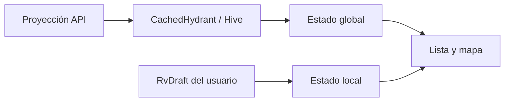
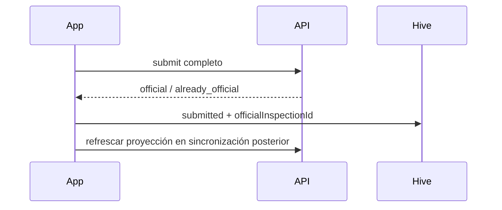
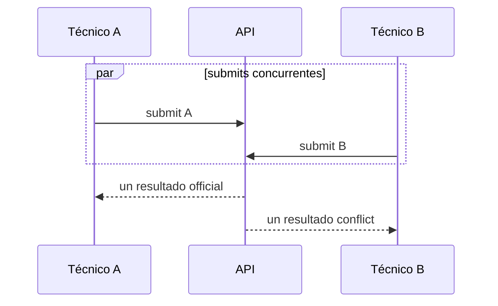
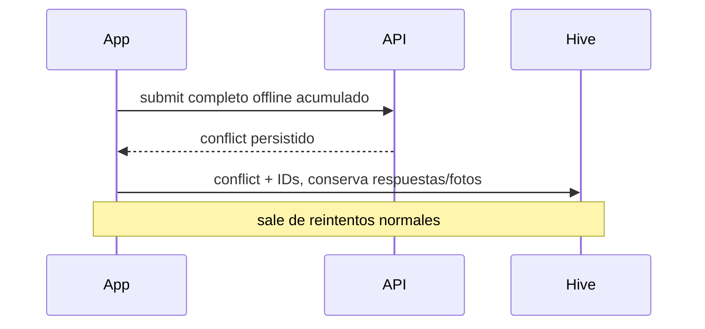
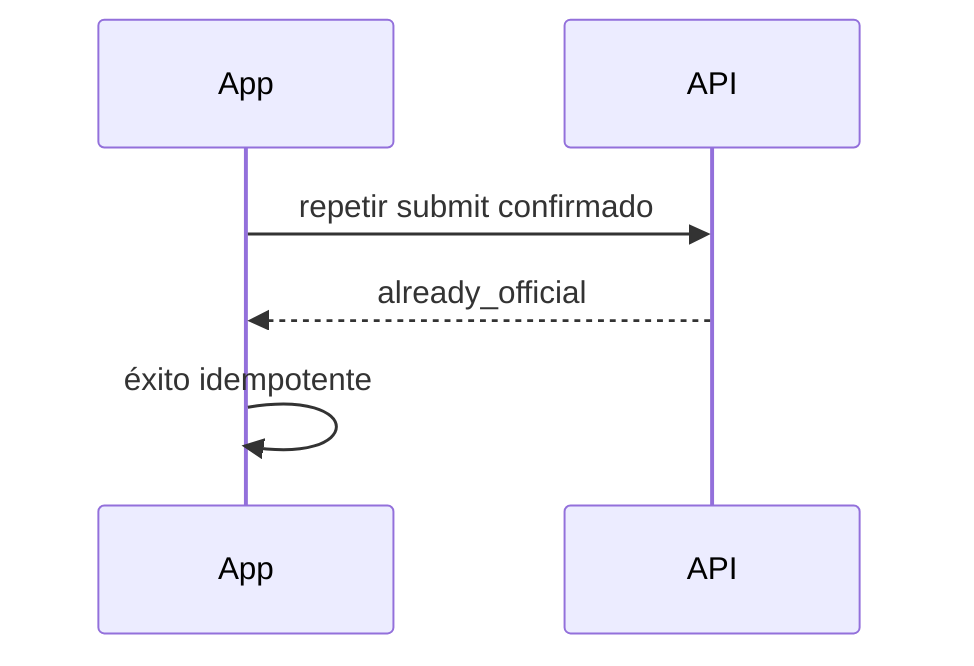
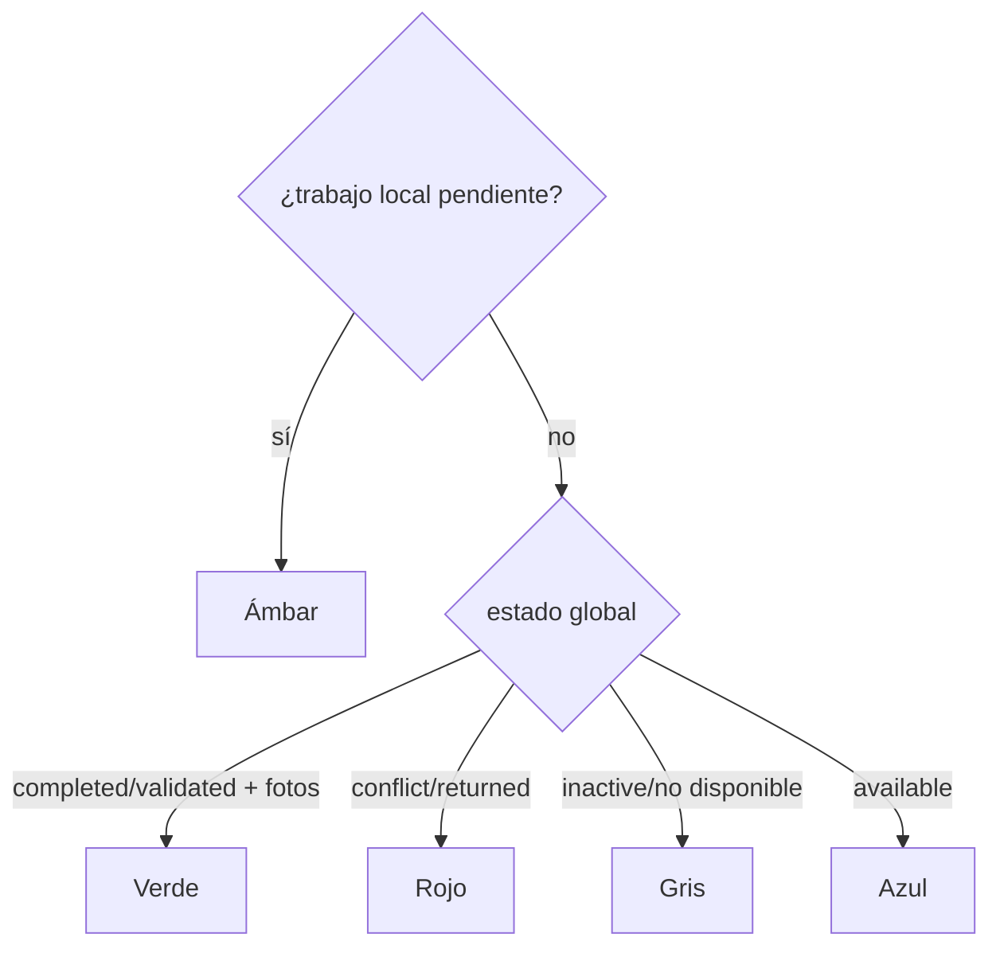
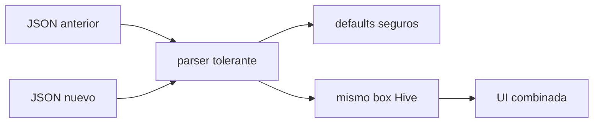
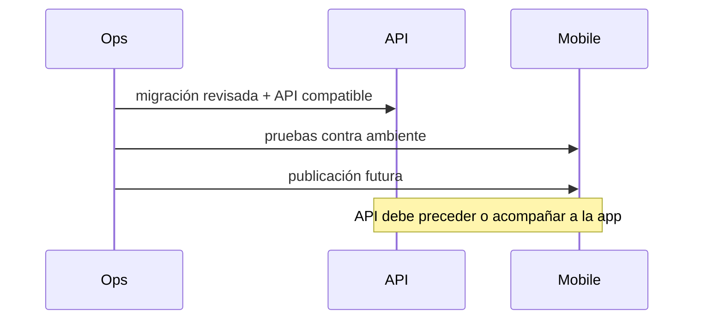

# Etapa 02: consumo del estado RV global

## Arquitectura implementada

`CachedHydrant` conserva la proyección canónica recibida del servidor; `Hydrant` la expone a lista y mapa. `RvDraft` mantiene el estado local y ahora persiste las referencias de oficial y conflicto. Los JSON legacy usan valores seguros sin migración destructiva de Hive.

## Submit y conflicto

## Estados globales y locales

Globales: `available`, `completed`, `validated`, `returned`, `conflict`, `inactive`. Locales incluyen borrador/en curso/pendiente/sincronizando/error, `submitted` y `conflict`. El local ámbar tiene prioridad visual; después verde para oficial con siete fotos verificadas, rojo para conflicto/devuelto, gris para inactivo/no disponible y azul para disponible.

## Caché, lista y búsqueda

Los campos nuevos se serializan en el box existente: oficial, fecha canónica, técnico, brigada, conflictos, disponibilidad, ronda, fotos e inactividad. Campos ausentes significan disponible/ronda 1/sin conflicto. La selección normal de nueva RV oculta revisados y no disponibles; un trabajo local continúa visible, y una coincidencia exacta de cuenta puede encontrar un revisado sin habilitar su edición.

## Rondas y proyección

La app consume `currentRound=1` y `availableForRv`; no abre rondas ni autoriza revisiones. Lista, mapa, snapshot y detalle comparten el contrato servidor de la etapa.

## Backfill y datos legacy

No se borran Hive, Secure Storage, SharedPreferences, borradores, colas, respuestas ni fotos. El estado `conflict` es terminal para reintento normal y de solo lectura, pero conserva la evidencia completa para resolución futura.

## Pruebas

Se cubren lectura legacy/nueva, serialización, fecha, disponibilidad, búsqueda exacta, colores, conflicto terminal, preservación de evidencia y parsing de `official`, `already_official` y `conflict`.

## Despliegue pendiente

## Riesgos y Prompt 3

El refresco global ocurre en la siguiente sincronización/carga ya disponible, no se rediseñó el orquestador completo. La pantalla de reporte, historial inmutable, edición app-plataforma, resolución de conflictos y rondas adicionales dependen de Prompt 3 y etapas posteriores.
