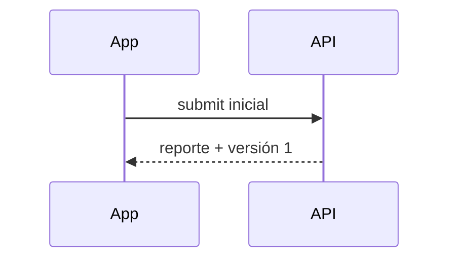
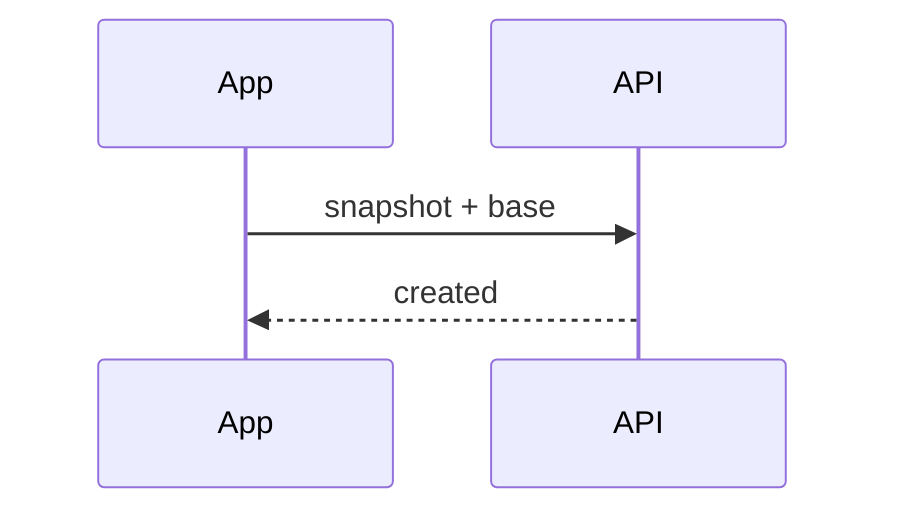
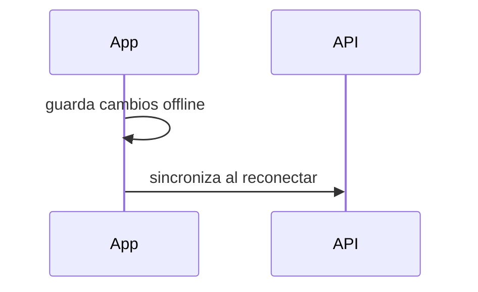
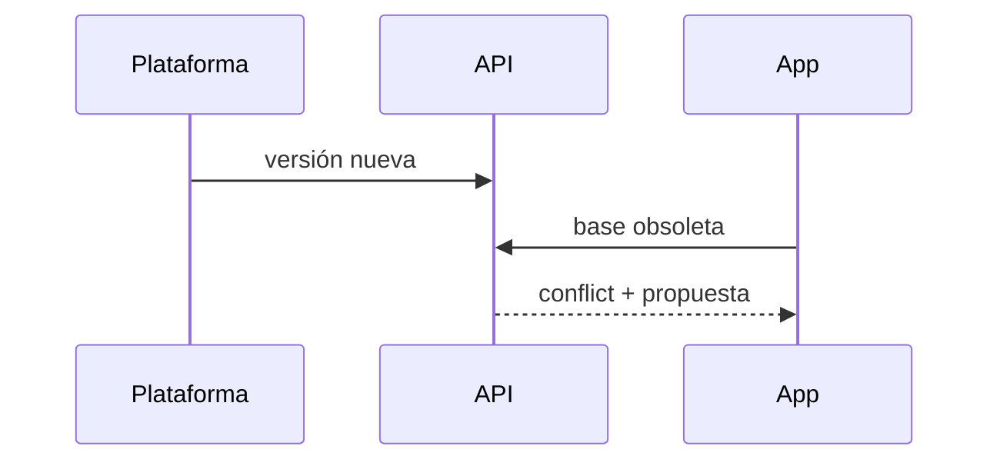
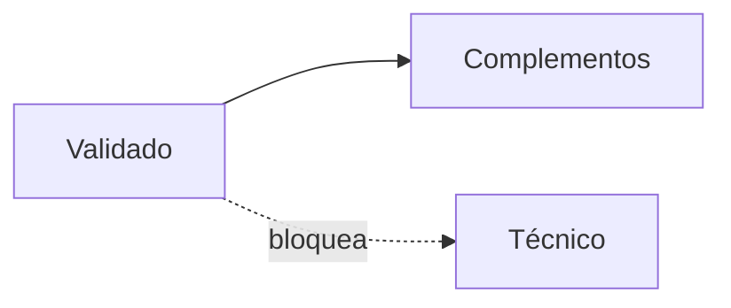
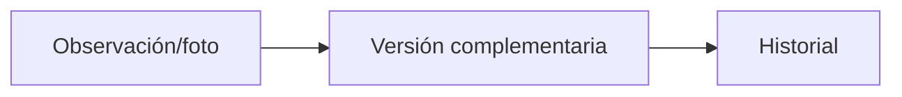
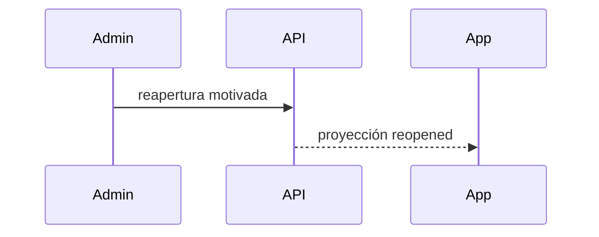
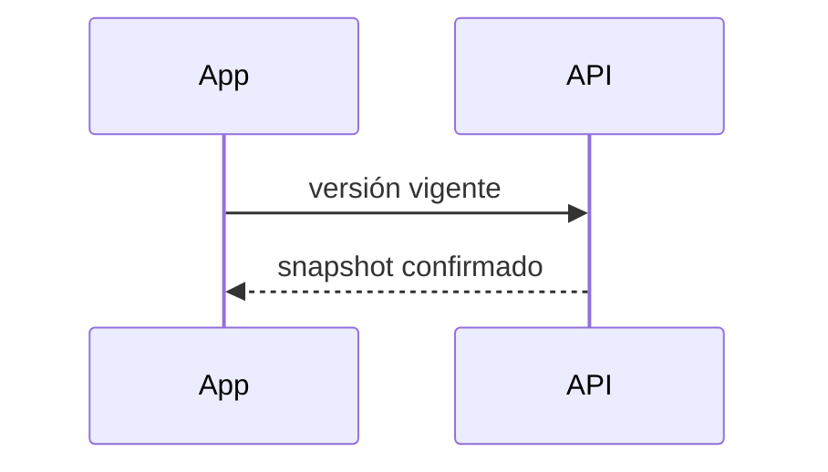
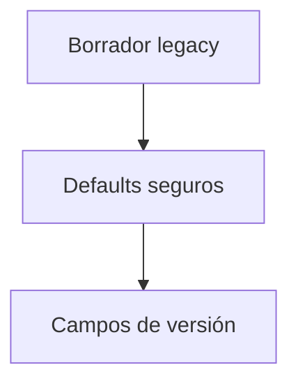
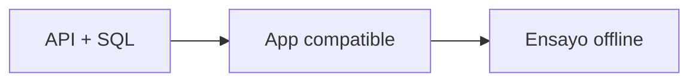

# Etapa 03 — Edición offline sobre versiones RV

## Arquitectura implementada

El borrador conserva reporte lógico, versión vigente/base, número base, comando cliente, modo de edición, validación y conflicto. La lectura es compatible con JSON legacy mediante valores seguros; Hive no se elimina ni cambia de box.

## Edición, permisos y fotografías

Antes de validar, el creador puede editar contenido técnico. Validado, el dominio bloquea contenido técnico y conserva complementos de observaciones/fotos generales. No creadores permanecen en solo lectura. Las referencias de fotos obligatorias y archivos pendientes siguen asociadas al borrador; nunca se limpian al producirse un conflicto.

## Sincronización e idempotencia

Los cambios pendientes envían snapshot, `baseVersionId`, `pendingVersionClientId` e `Idempotency-Key`. `created` y `already_created` avanzan la base. `conflict` conserva cambios, guarda versión oficial/propuesta y sale de reintentos normales. `forbidden_after_validation` conserva el borrador y cambia a complementos permitidos.

## Persistencia, migración y rollback

Los campos nuevos son opcionales/default y se serializan en el mismo borrador. No hay borrado ni migración destructiva de Hive, fotos, colas o datos legacy. El rollback móvil consiste en retirar el código después de desplegar primero una API compatible; los campos desconocidos persistidos son tolerados.

## Pruebas, despliegue y riesgos

Se cubren lectura legacy/nueva, permisos, resultados de versión y persistencia de conflicto. El flujo SQL real y pruebas extremo a extremo con plataforma futura quedan pendientes. La pantalla completa, diff y resolución se implementarán después.

## Flujos

## Dependencias para Prompt 4

La pantalla deberá consumir el snapshot vigente, mostrar metadatos/versiones y fotografías sin habilitar edición ajena ni mezclar una propuesta conflictiva con la versión oficial.
