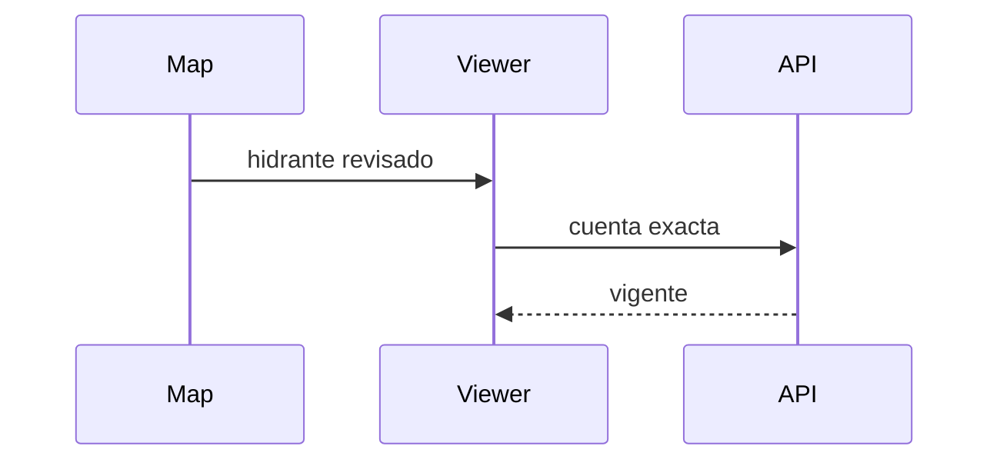
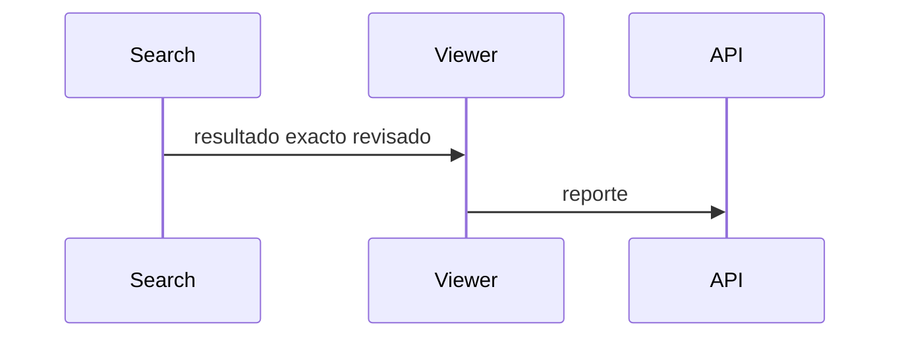
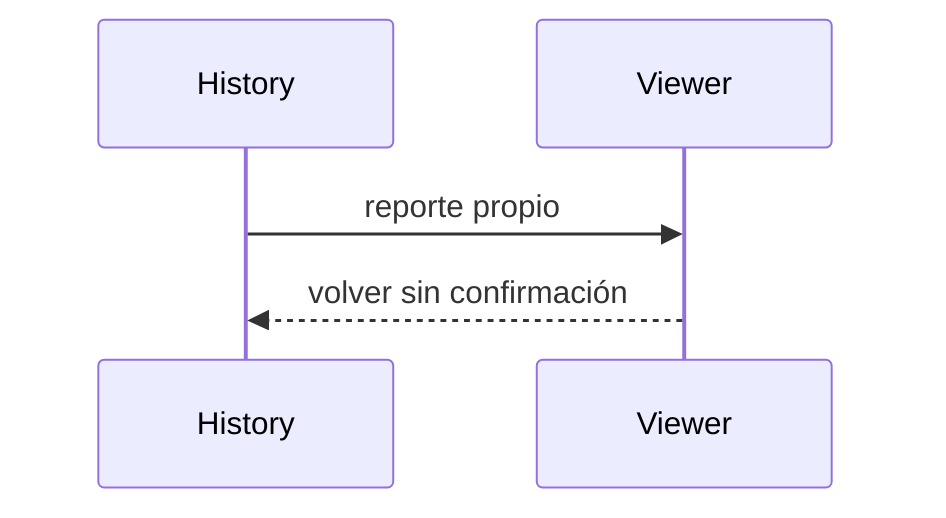
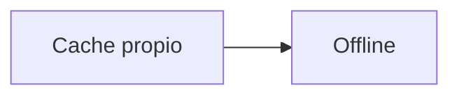
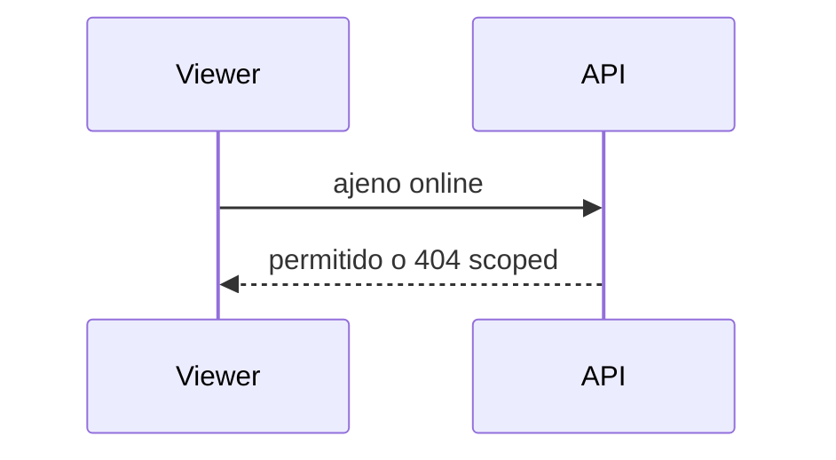
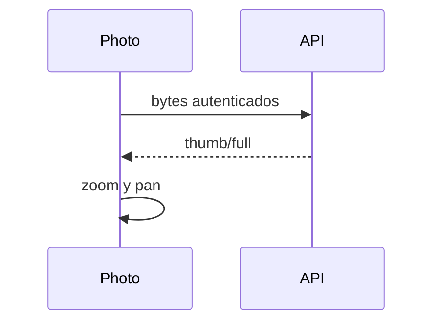
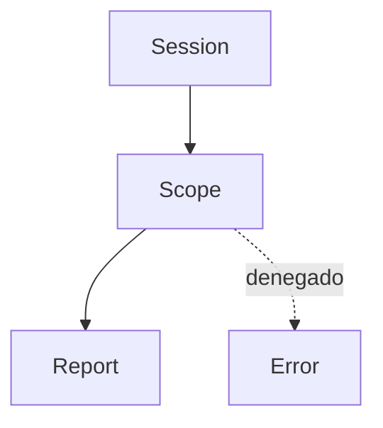
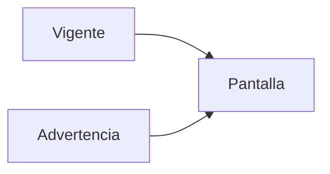
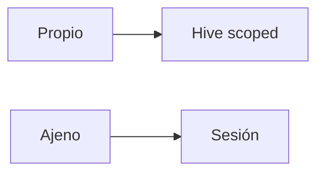
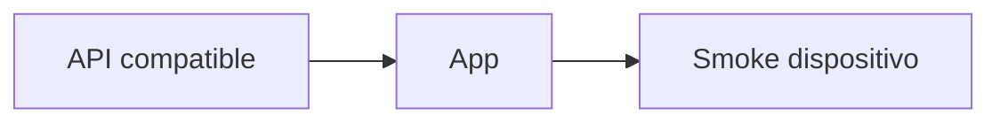

# Etapa 04 — Visor móvil RV

## Objetivo y arquitectura

`VisualReportRepository` obtiene por cuenta el contrato oficial tipado. `RvVisualReportPage` es de solo lectura, adaptable y reutilizable; presenta encabezado, estado, versión, responsable, ubicación, señal, secciones, fotos, observaciones y conflicto.

## Caché, propios, ajenos y offline

Los reportes propios confirmados se guardan en `visual_report_cache_v1` usando clave usuario+cuenta. Reportes ajenos solo viven en memoria de sesión y requieren conexión. El cambio de usuario usa otra clave y no mezcla datos. Ninguna foto ajena se persiste en Hive o galería.

## Pantalla, navegación y estados

Mapa, coincidencia exacta e historial/detalle abren la misma ruta. Un hidrante no disponible nunca ofrece iniciar RV. La pantalla usa `SafeArea`, ancho máximo, tarjetas, `ExpansionTile`, etiquetas semánticas, scroll y estados de carga/error/reintento. No muestra localidad, municipio, correo, teléfono ni IDs técnicos.

## Fotografías y privacidad

Miniaturas y originales se solicitan autenticados. El visor usa `PageView` e `InteractiveViewer`, contador, zoom/pan, cierre, error y reintento. No ofrece compartir, descargar, guardar, URL o aplicación externa.

## Compatibilidad, pruebas, riesgos y despliegue

Modelos tolerantes convierten valores ausentes en `No capturado` y aceptan secciones/catálogos futuros. Pruebas cubren parseo completo/legacy, privacidad, visor y tres orígenes de navegación. Queda pendiente smoke test físico y SQL/API reales. Desplegar API compatible antes de la app.

## Dependencias para Prompt 5

Los campos desconocidos y unidades ya son renderizables; el rango global de manómetro puede añadirse al contrato sin rediseñar la pantalla.
