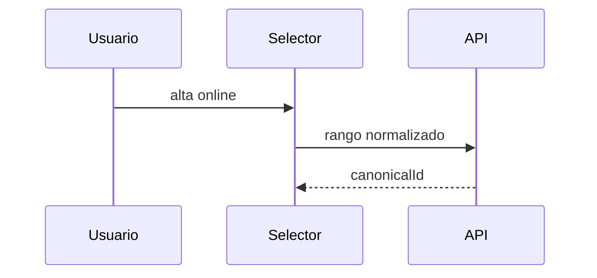
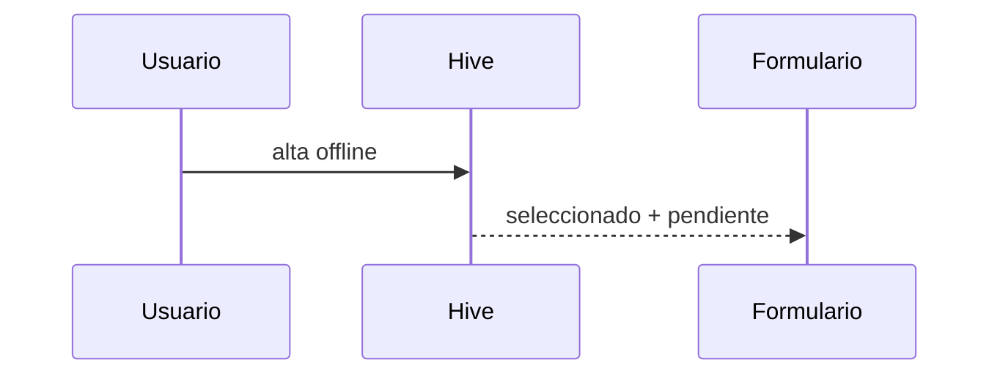
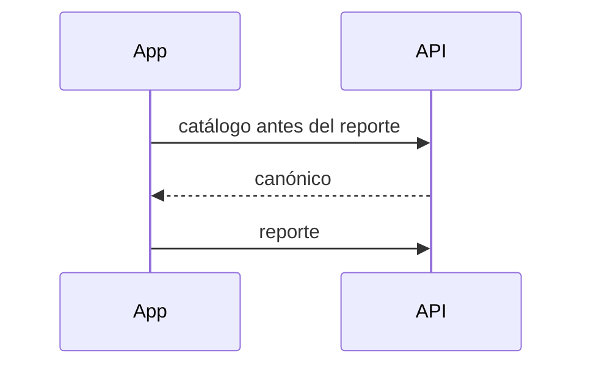
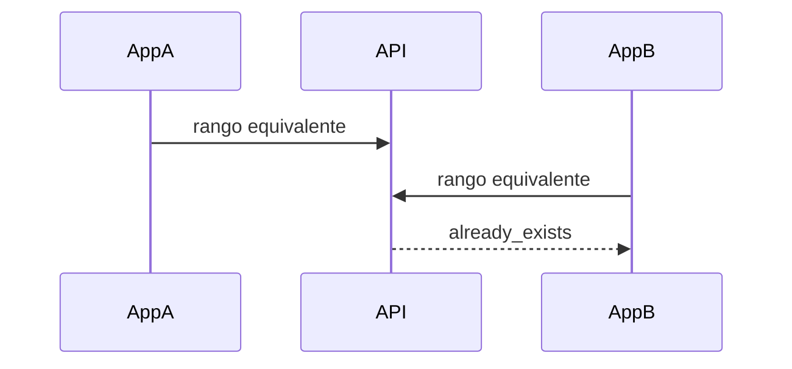
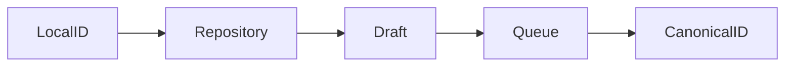
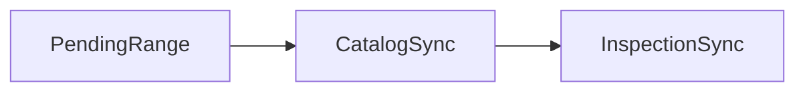
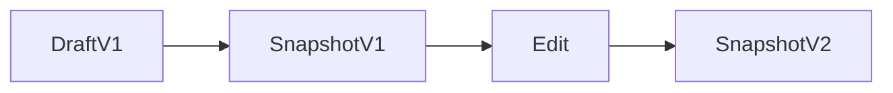
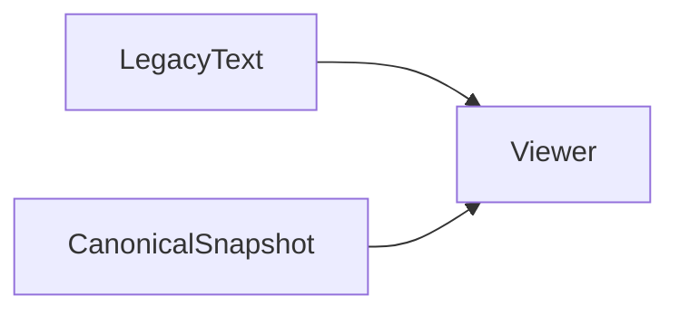
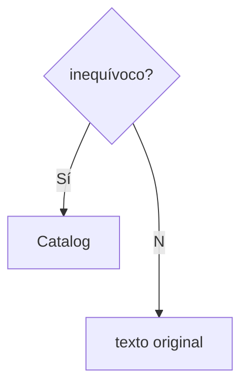
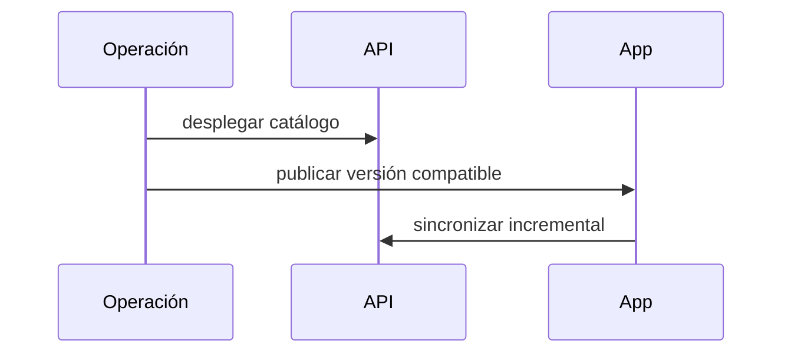

# Etapa 05 — Catálogo global de rangos de manómetro

## 1. Objetivo y campos

La app sustituye la captura libre RV por un selector global offline-first; RF permanece intacto.

| Código | Sección | Control anterior | Control nuevo |
|---|---|---|---|
| `sustaining_gauge_range` | Sostenedora | dinámico libre | `PressureRangeSelector` |
| `regulating_gauge_range` | Reguladora | dinámico libre | `PressureRangeSelector` |
| `filter_gauge_before_range` | Filtro antes | dinámico libre | `PressureRangeSelector` |
| `filter_gauge_after_range` | Filtro después | dinámico libre | `PressureRangeSelector` |
| `parcel_gauge_range` | Parcelaria | dinámico libre | `PressureRangeSelector` |
| `visibleRange/visibleUnit` | Manómetros visuales RV | dos textos | `PressureRangeSelector` |

## 2. Arquitectura y catálogo local

`DynamicCatalogRepository` conserva sincronizados globales y pendientes privados por propietario. `PressureRangeOption` guarda IDs local/canónico, límites, unidad, estado y activo. Al sincronizar, el pendiente se promueve a global y borradores/colas resuelven el ID con el remapeo existente.

## 3. Captura, validación y accesibilidad

El selector busca, agrupa valores legibles y permite alta con mínimo, máximo y unidad cerrada psi/bar. Valida finitud, no negativos y máximo mayor; selecciona duplicados locales. Incluye semántica, etiquetas y estado pendiente textual.

## 4. Offline, respuestas y versiones

Un alta offline queda disponible inmediatamente al propietario. Los catálogos se sincronizan antes de reportes. El payload incluye referencia y snapshot. Editar antes de validar genera la siguiente versión; tras validación rigen los bloqueos técnicos de Prompt 3. Hive, borradores, fotos y colas no se limpian.

## 5. Visualizador y legacy

Se muestra `0–100 psi` o `0,5–6,5 bar`, nunca UUID. Un snapshot inactivo conserva su display. Texto legacy se conserva y ausencia se muestra como `No capturado`.

## 6. Flujos

## 7. Pruebas, riesgos y despliegue

Pruebas cubren formato, normalización, duplicado, persistencia y aislamiento. Riesgos: el documento visual legacy mantiene además campos de compatibilidad hasta una migración posterior; los valores ambiguos no se inventan. Pendientes: smoke test de todos los selectores, ensayo SQL acumulado y despliegue.

## 8. Dependencias para Prompt 6

La presentación tipada y el snapshot extensible están listos para la opción Marca Ilegible y su evidencia.

