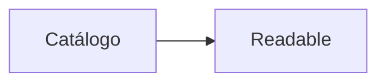
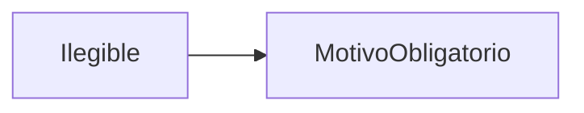
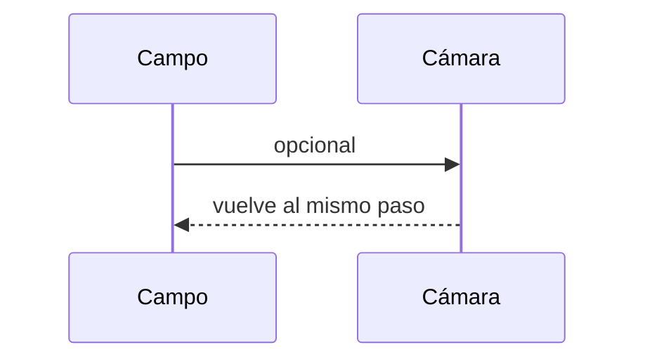
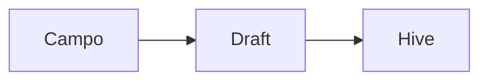
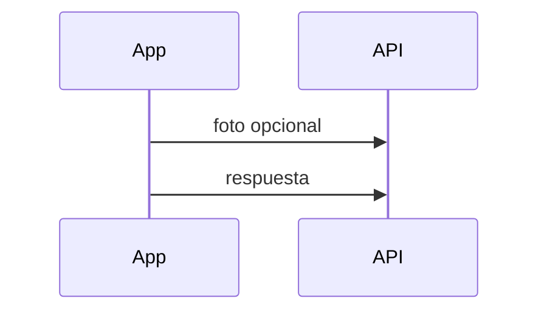
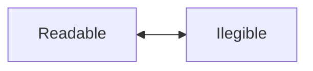
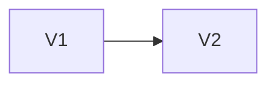
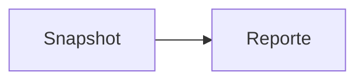
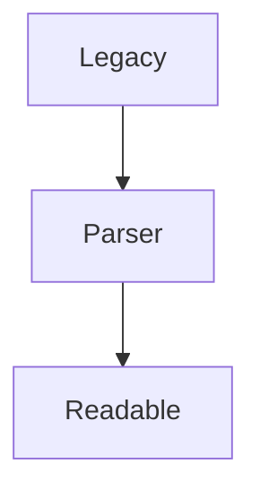
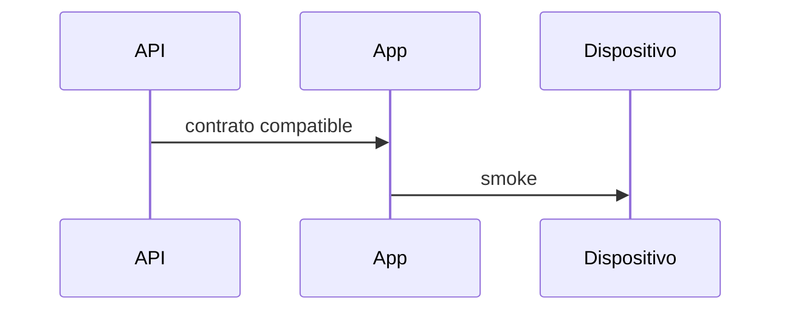

# Etapa 06 — Captura Marca ilegible RV

## Objetivo e inventario

`Ilegible` es una opción fija del selector RV y no se persiste/sincroniza como fabricante.

| Código/familia | Sección | Tipo | Control actual | Fuente | Adaptación |
|---|---|---|---|---|---|
| `*brand*` checklist RV | componentes dinámicos | inferido por código | `_BrandField` | catálogo global | chip Ilegible + motivo |
| `valveBrand` | parcelarias | válvula | `_BrandField` | VALVE | condición especial |
| `solenoidBrand` | parcelarias | solenoide | `_BrandField` | SOLENOID | condición especial |
| `pilotBrand` | parcelarias | piloto | `_BrandField` | PILOT | condición especial |
| `pressureGaugeBrand` | parcelarias | manómetro | `_BrandField` | PRESSURE_GAUGE | condición especial |
| legacy | checklist versionado | variable | parser tolerante | snapshot | readable/no capturado |

RF no usa este modelo.

## Modelo, selector y validación

`BrandSelection` distingue readable/illegible, IDs, display, motivo y evidencia local/remota. Elegir Ilegible limpia IDs; elegir fabricante crea readable y elimina motivo. El formulario exige 10 caracteres, pero la foto es opcional.

## Foto, offline y sincronización

La evidencia usa `ReliablePhotoService`, slots por item, Hive y la cola con integridad existentes. La sincronización procesa fotos antes de respuestas para adjuntar ID remoto cuando existe. Un fallo conserva la foto y permite enviar sin evidencia.

## Versionado, visor y legacy

El snapshot enviado incluye modo, motivo y evidencia. Validado bloquea el selector por el readOnly existente. El visor recibe display Ilegible/motivo y usa el visor fotográfico seguro. Un brandId legacy se interpreta readable; ausente permanece No capturado.

## Flujos

## Pruebas, riesgos y despliegue

Pruebas cubren modelo, serialización, exclusión, mínimo, inventario y RF intacto. Riesgo: eliminación/reemplazo visual específico de evidencia se perfeccionará junto con navegación de pendientes; el almacenamiento y remove seguro ya existen. Desplegar SQL/API antes de app.

## Dependencia Prompt 7

Listo para aplicar el mismo patrón a `Indefinido` en “Tiene elemento filtrante”.

