# Etapa 07 — Captura Indefinido en elemento filtrante

## 1. Objetivo y estado actual

La pregunta RV `filter_element` (“Tiene elemento filtrante.”) usaba el renderer booleano. Ahora usa un control de tres estados y un motivo condicionado. RF permanece intacto.

| Aspecto | Estado anterior | Cambio implementado |
|---|---|---|
| Código | `filter_element` | Sin cambio |
| Etiqueta | Tiene elemento filtrante. | Sin cambio |
| Tipo | Booleano dinámico | Selector especializado Sí/No/Indefinido |
| Persistencia | `bool` en borrador | Objeto `{state, reason}` compatible con bool legacy |
| Dependencias | Comparación directa con `true` | Solo `present` equivale a true |
| Validación | Respuesta requerida | Motivo trim de 10–500 para Indefinido |
| Resumen | Sí/No | Indefinido incluye motivo |
| Visor | Valor genérico | Etiqueta española sin código técnico |

## 2. Estados y dependencias

- `present`: Sí, muestra y exige los campos técnicos actuales.
- `absent`: No, oculta los dependientes y limpia motivo activo.
- `undefined`: Indefinido, muestra motivo y oculta dependientes sin convertirse en No.
- Ausente: No capturado.

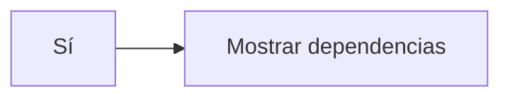

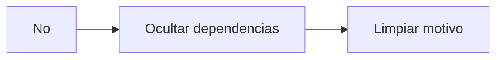

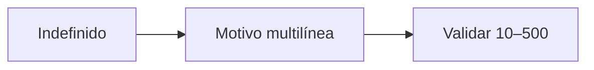

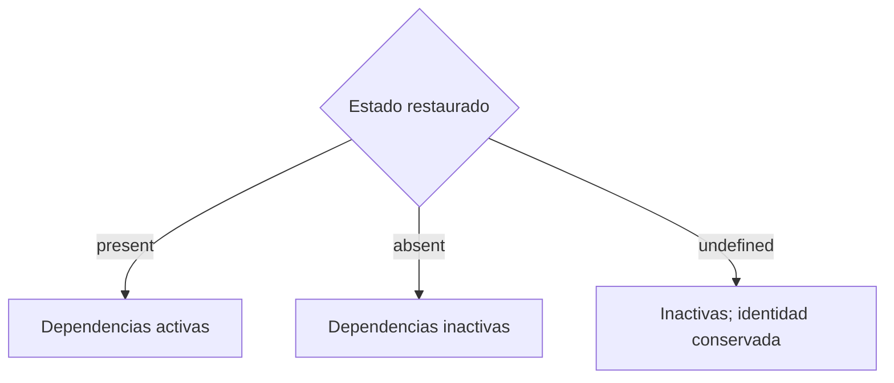

## 3. Modelo Flutter y compatibilidad legacy

`FilterElementSelection` contiene el enum interno `present`, `absent`, `undetermined`; este último serializa `undefined`. `true` y `false` legacy se restauran como present y absent; null sigue sin respuesta. Sí/No siempre serializan motivo nulo.

## 4. Renderer, validación y resumen

El renderer dinámico detecta exclusivamente `filter_element`, usa `SegmentedButton`, muestra un `TextFormField` accesible con contador máximo y autoguarda cada cambio. El validador genera `filter_element_reason_missing` y conserva la sección/ítem para navegación desde pendientes. No existe cámara, evidencia ni slot fotográfico.

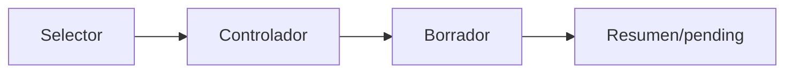

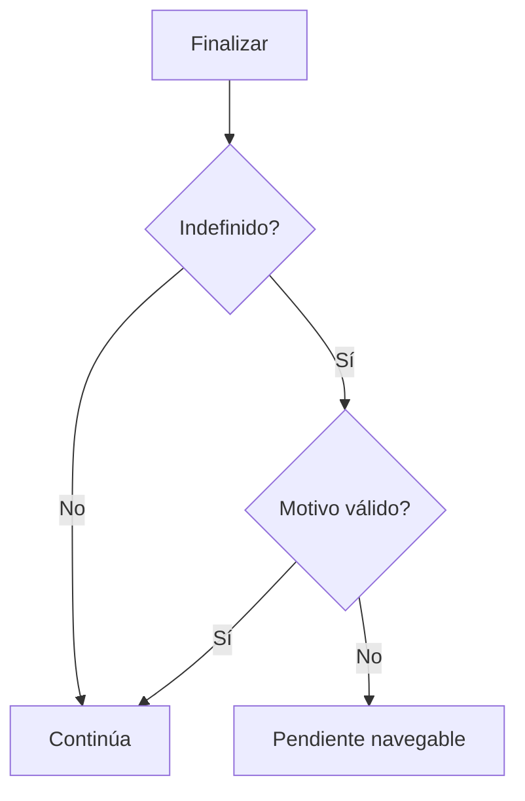

## 5. Offline y sincronización

El objeto vive en la persistencia existente del borrador y no requiere catálogo ni fotografía. Los fallos temporales conservan estado/motivo; el payload builder lo envía con la siguiente sincronización y un conflicto de versión conserva la propuesta.

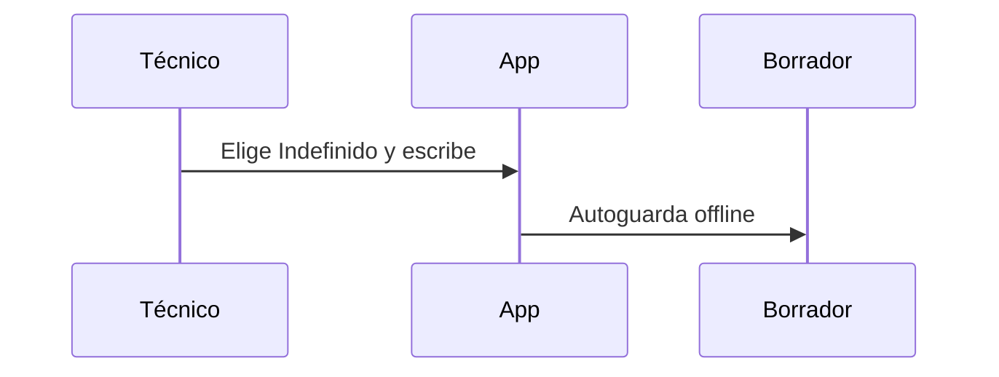

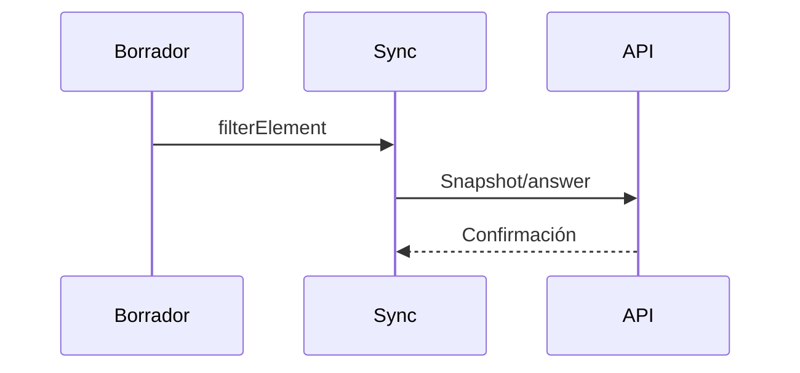

## 6. Versionado, visor y analítica

Una edición sincronizada usa el flujo inmutable existente. Versiones anteriores conservan estado/motivo y una revisión validada permanece bloqueada. El visor recibe `displayValue` y observación legible. El estado estructurado habilita analítica separada Sí/No/Indefinido/No capturado.

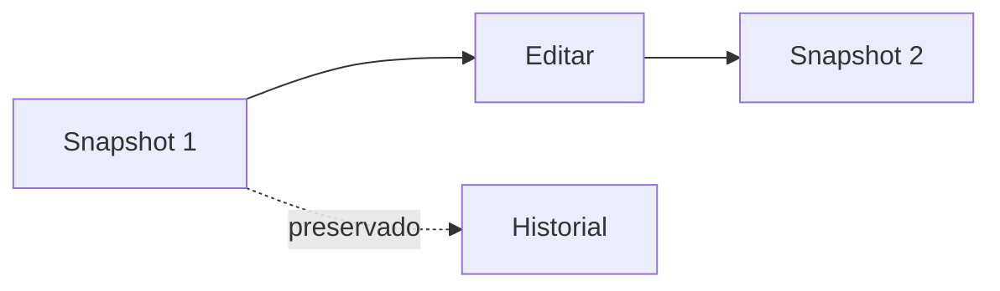

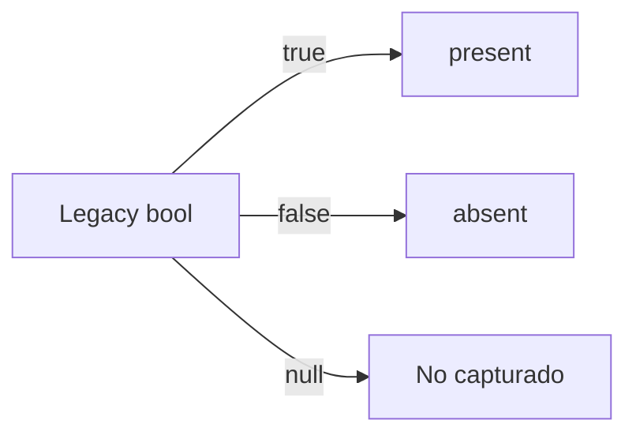

## 7. Pruebas, riesgos y despliegue

Se prueban estados, legacy, límites, limpieza de motivo, renderer RV, payload y ausencia de integración RF/fotográfica. Riesgos: clientes antiguos no capturan Indefinido y el backend debe desplegarse con su migración antes de depender del nuevo estado.

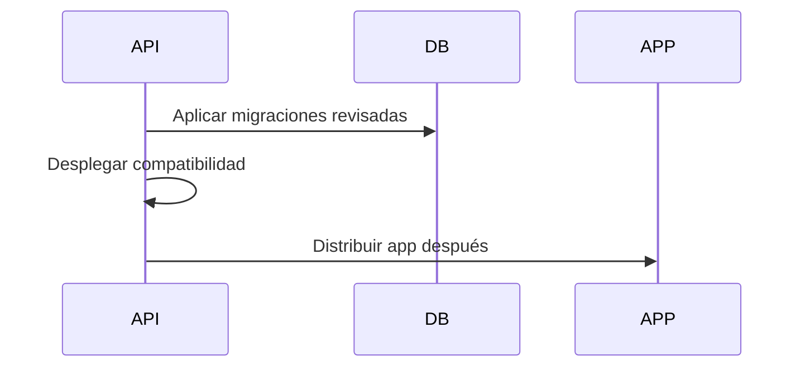

Pendiente: ensayo acumulado en SQL Server 2014, smoke test de dependencias y despliegue futuro.

## 8. Dependencias para Prompt 8

La especialización queda limitada a `filter_element`; la pregunta de pilotos conectados puede implementar su propio contrato sin heredar Indefinido ni alterar RF.
