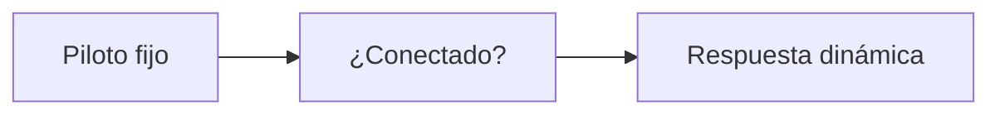
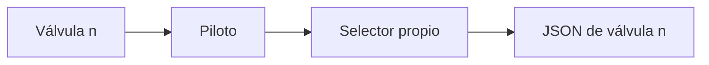
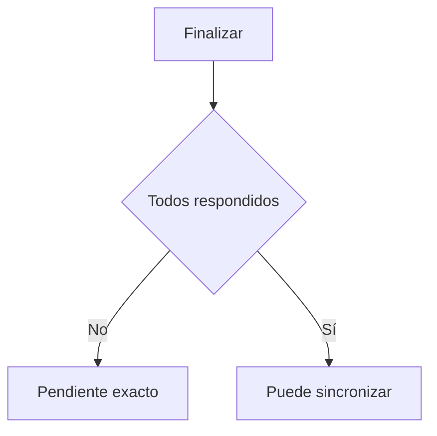
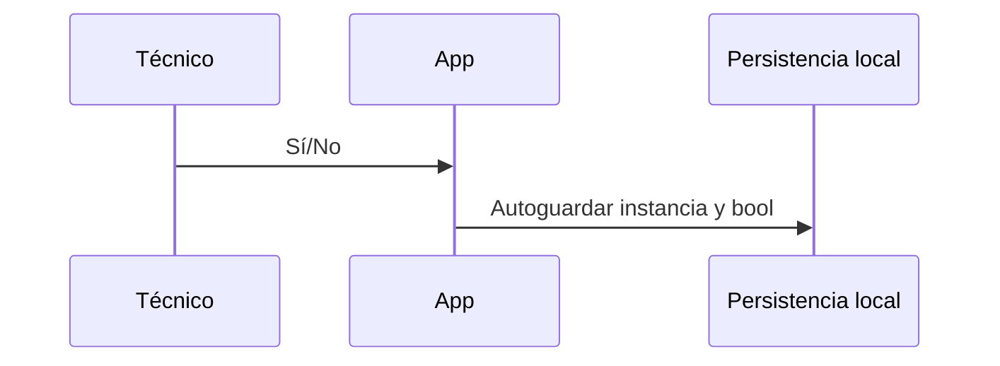
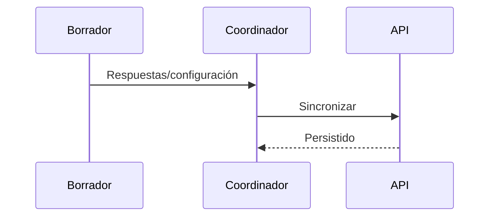
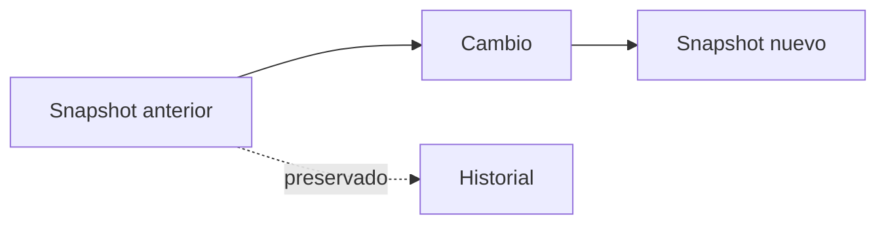
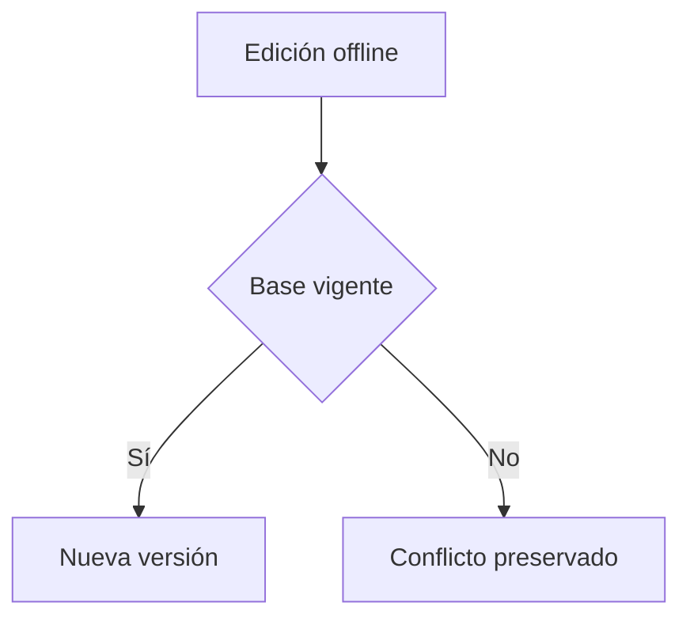
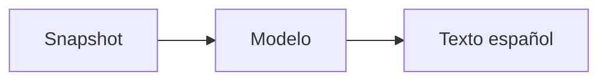
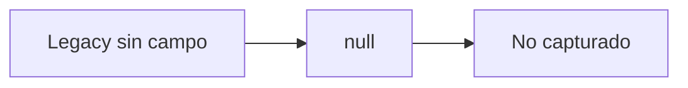
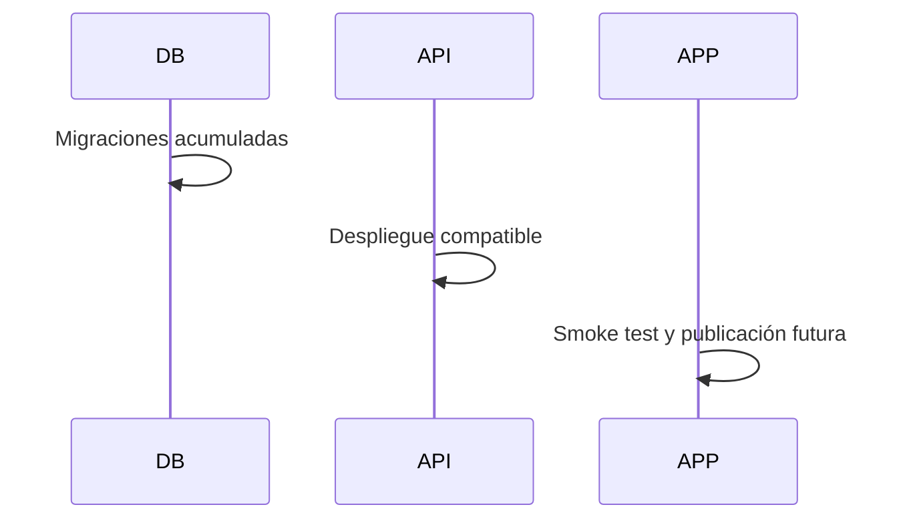

# Etapa 08 — Pregunta de conexión en pilotos RV

## 1. Objetivo

Capturar Sí/No obligatoriamente para cada piloto RV. `bool?` conserva tres situaciones de almacenamiento: true, false y todavía no capturado. La interfaz solo ofrece Sí y No; no agrega explicación, fotografía ni Indefinido. RF permanece intacto.

## 2. Inventario

| Código o campo | Sección | Componente padre | Persistencia anterior | Repetible | Adaptación |
|---|---|---|---|---|---|
| `sustaining_pilot` | Válvula reguladora/sostenedora | Piloto sostenedor | Respuesta dinámica | No | Ítem dependiente `sustaining_pilot_connected` |
| `regulating_pilot` | Válvula reguladora/sostenedora | Piloto regulador | Respuesta dinámica | No | Ítem dependiente `regulating_pilot_connected` |
| `ParcelValve.hasPilot` | Válvulas parcelarias | Cada tarjeta de válvula | Modelo JSON local | Sí | `pilotConnected` por válvula |
| `sustaining-pilot` visual | Componentes visuales | Piloto sostenedor físico | `specificData` | No | Booleano tipado |
| `regulating-pilot` visual | Componentes visuales | Piloto regulador físico | `specificData` | No | Booleano tipado |

Marca/modelo son datos del piloto; no se cuentan como pilotos adicionales.

## 3. Modelo, captura y validación

`ParcelValve.pilotConnected` y `VisualComponentSpecificData.pilotConnected` son `bool?`. Los ítems dinámicos usan la respuesta booleana existente. El control es `SegmentedButton<bool>` con selección inicialmente vacía, semántica accesible y sin campos condicionados. El validador produce `pilot_connection_missing` con sección, válvula e identificador de foco.

## 4. Offline y sincronización

La selección autoguarda en el borrador existente, se restaura tras reinicio y viaja dentro de respuestas o configuración parcelaria. No necesita catálogo, foto ni cola independiente. Fallos temporales y conflictos conservan el valor propuesto.

## 5. Versionado y conflicto

Cambiar la respuesta antes de validar se incorpora a un snapshot nuevo. La versión anterior queda intacta. Los bloqueos existentes impiden la edición técnica validada y un conflicto conserva la propuesta sin sobrescribir la vigente.

## 6. Visor, analítica y legacy

El resumen y el visor muestran “Piloto conectado: Sí/No/No capturado”. Cada válvula parcelaria conserva su índice. Nunca se muestran true, false, null ni UUID. Los borradores y reportes legacy restauran null sin inferir No. Esto habilita análisis conectado/no conectado/sin captura por instancia y contexto.

## 7. Pruebas, riesgos y despliegue

Se cubren round-trip true/false/null, limpieza al retirar piloto, snapshot visual, presencia de ambos flujos RV y ausencia en RF/fotos/motivos. Riesgos: clientes antiguos no pueden completar el nuevo requisito y debe respetarse el orden migración–API–app.

## 8. Dependencias para Prompt 9

La captura queda aislada de evidencia y comentarios. El paso de fotografías y observaciones generales puede añadirse sin alterar este booleano ni sus dependencias.
