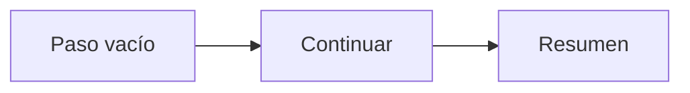
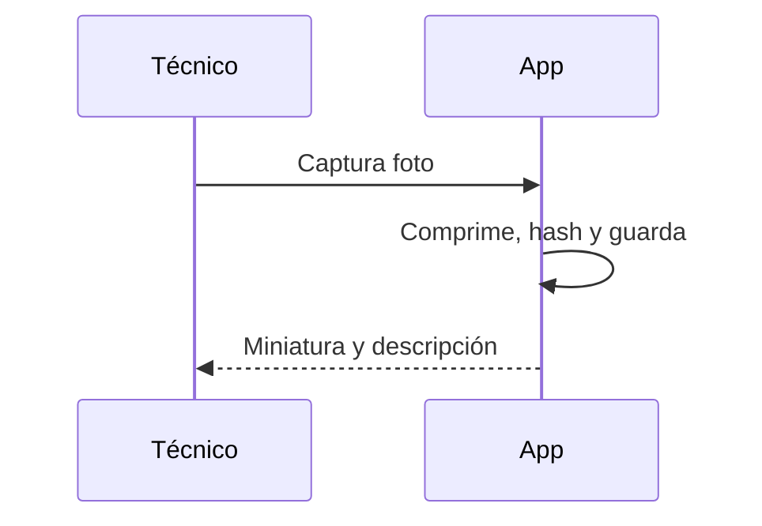
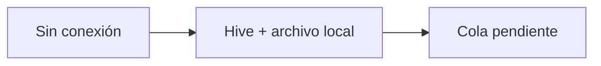
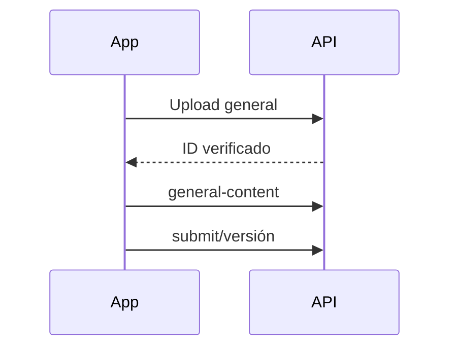
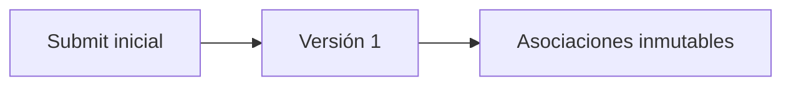
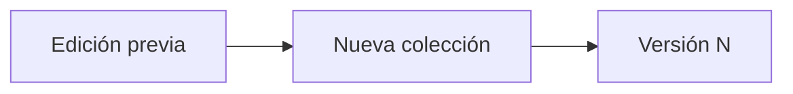
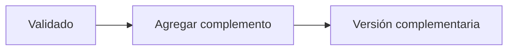
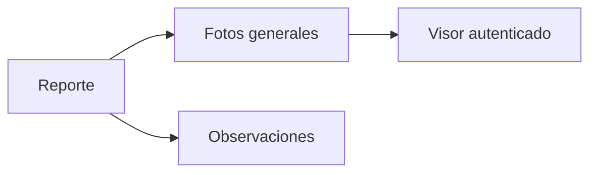
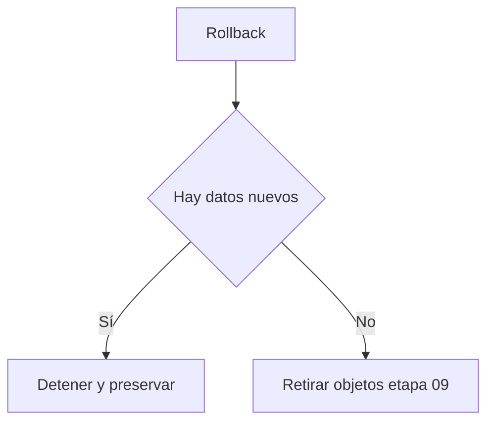
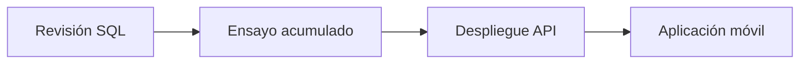

# Etapa 09 — Paso Flutter de fotografías y observaciones generales RV

## Objetivo y arquitectura

Se añadió contenido opcional al cierre RV sin crear otro subsistema multimedia. La API reutiliza `rv.photos`, su hash SHA-256, verificación, autorización y almacenamiento privado. Las asociaciones de `rv.visual_report_version_photos` son inmutables; `general_observation` forma parte del snapshot y de su hash.

## Flujo actual y cambio

| Elemento | Implementación actual | Reutilización o cambio |
|---|---|---|
| Captura fotográfica | Upload autenticado por inspección | Slot `general:<UUID>` |
| Compresión | Pipeline Sharp existente | Sin cambios |
| Persistencia local | Cola confiable Flutter | Reutilizada |
| Integridad | Hash cliente/servidor | Obligatorio antes de confirmar |
| Cola | Cola fotográfica por propietario | Reutilizada |
| Versionado | Asociaciones por `version_id` | Colección ordenada, máximo cinco |
| Visor | Miniatura/contenido autenticado | Categoría `general` |
| Observaciones | `general_comments` y snapshot | Normalizadas, máximo 2,000 |

## Modelo SQL, migración y rollback

`rv.photos` incorpora `general_order TINYINT` y `general_description NVARCHAR(300)`. Los índices impiden dos posiciones activas iguales. Las versiones limitan la descripción a 300 y la observación a 2,000. La migración es `database/migrations/20260801_rv_general_photos_observations.sql`; el rollback conservador se detiene si encuentra datos nuevos. No se ejecutaron.

## Flutter, API, validación y seguridad

- `RvGeneralPhotosAndObservationsStep`: paso opcional, contador, descripciones y observaciones.
- `RvDraft`: persiste orden, descripción, observaciones y estados legacy-safe.
- `InspectionSyncCoordinator`: carga fotos antes de crear versión.
- `PUT /inspections/{id}/general-content`: colección exacta previa a submit y observación.
- `POST /inspections/{id}/photos`: acepta `general:<UUID>`, hasta cinco.
- `POST /visual-reports/{id}/versions`: acepta fotos ordenadas y observación; el comando sigue siendo idempotente.
- Sólo acepta fotos de la inspección oficial, categoría general, hash verificado y propietario correcto.
- No se exponen rutas físicas; visor y miniaturas conservan autorización anti-IDOR y `nosniff`.

Antes de validar se crea un snapshot exacto nuevo. Después de validar sólo se agregan asociaciones y observaciones como complemento; nunca se retiran asociaciones confirmadas. Fotos obligatorias y evidencia ilegible no cuentan en el límite.

## Offline, sincronización y visor

Flutter sube primero los archivos, reconcilia IDs, guarda el contenido general y después envía el submit o versión. Un fallo deja todo pendiente. El visor recibe fotos generales separadas, descripción, orden y observaciones; mantiene zoom autenticado y sin compartir/descargar.

## Diagramas

## Pruebas, riesgos y despliegue pendiente

Las pruebas cubren cero/cinco/seis fotos, unicidad, longitudes, normalización, integridad, snapshot y rollback no destructivo. Pendientes operativos: revisión SQL, ensayo acumulado en SQL Server 2014, smoke test cámara/galería y despliegue coordinado. Riesgos: disponibilidad del almacenamiento privado y tiempos de upload con cinco imágenes. Prompt 10 podrá reutilizar el índice sintético del paso para navegación exacta y resaltado.
