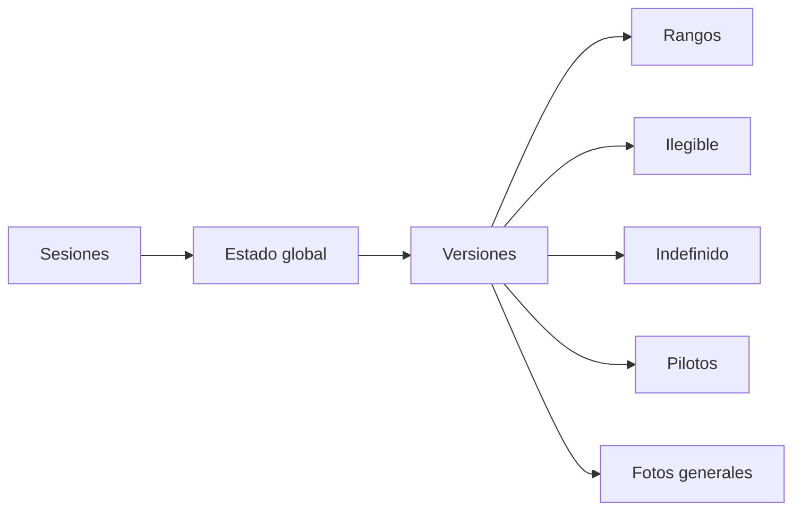
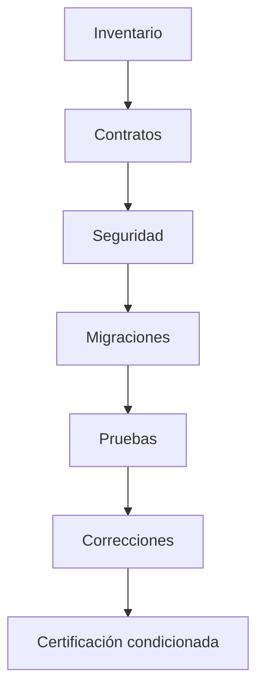
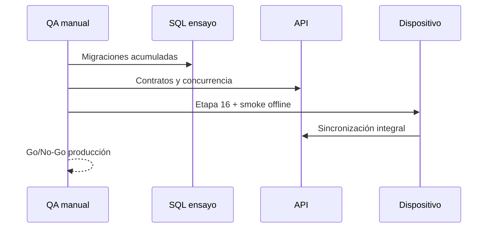

# Etapa 17 — Auditoría técnica acumulada Flutter RV

## Resumen ejecutivo

Se auditó la cadena Prompts 1–9 y etapas 10–15 en Git, SQL, API, Flutter, OpenAPI y pruebas. No hay hallazgos críticos abiertos en código local. Recomendación: **Go condicionado** para etapa 16 manual; **No-Go para producción** hasta ensayo acumulado SQL Server 2014, concurrencia y dispositivos reales.

## Inventario de ramas

La cadena culmina en `feature/rv-general-photos-observations`; esta auditoría parte de ella en `feature/rv-operational-hardening`. Cada repositorio conserva commits separados y remoto `origin`. No se detectaron cambios ajenos iniciales.

## Inventario y orden de migraciones

| Orden | Script | Dependencia | Objetos principales | Rollback/riesgo |
|---:|---|---|---|---|
| 1 | permanent_field_sessions | esquema referencia | dispositivos, vínculos, sesiones/tokens | revocaciones activas |
| 2 | global_rv_status_exclusivity | 1 | rondas, claims, conflictos, proyección | backfill de oficialidad |
| 3 | immutable_rv_versioning | 2 | reportes, versiones, hijos, conflictos | snapshots históricos |
| 4 | global_pressure_ranges | 3 | catálogo e integración snapshot | referencias canónicas |
| 5 | rv_illegible_brand | 3 | legibilidad, motivo, evidencia | datos técnicos nuevos |
| 6 | rv_filter_element_undefined | 3 | estado/motivo filter_element | undefined no vuelve a bool |
| 7 | rv_pilot_connection | 3 | ítems/parcelarias pilot_connected | respuestas nuevas |
| 8 | rv_general_photos_observations | 3,5 | orden/descripción/observaciones | asociaciones históricas |

Todos usan SQL Server 2014, transacciones o guardas idempotentes; no usan `CREATE OR ALTER`. Los rollbacks sensibles se detienen antes de perder datos. Los nombres comparten fecha, por lo que el despliegue debe usar este orden explícito, no orden lexicográfico.

## Contratos API–Flutter

Se compararon sesiones, hidrantes, submit, fotos, catálogos, versiones y contenido general. Correcciones: errores submit ahora llevan step/focus/section/instancia; cancelación móvil eliminada y ruta API convertida en administrativa; contenido general mantiene máximo y nullabilidad; estados del mapa respetan conflicto/inactivo antes de trabajo local. OpenAPI refleja las rutas.

## Hallazgos

- Críticos: ninguno abierto.
- Altos corregidos: cancelación destructiva disponible a técnico; prioridad ámbar ocultaba conflicto/inactividad; múltiples taps no compartían ejecución.
- Medios corregidos: pendientes GPS/foto sin paso/foco; dashboard con categorías técnicas incompletas; leyenda sólo azul/verde; Home mostraba localidad.
- Bajos corregidos: progreso porcentual poco demostrable y nomenclatura “Sincronización” en lugar de “Sincronizar todo”.
- Pendientes: pruebas SQL reales, carreras simultáneas, smoke Android/iOS, etapa 16 y dependencias vulnerables.

## Seguridad y privacidad

Sesión persistente, dispositivo y revocación permanecen diferenciados. Fotos requieren relación/autorización y no exponen rutas. Cambio de usuario conserva aislamiento. Lista/reporte no exponen correo/teléfono; dashboard ya no muestra localidad/municipio. RF no se modificó funcionalmente.

## Vulnerabilidades

`npm audit`: 4 (0 críticas, 2 altas, 2 moderadas). Altas: `sharp <0.35.0` directa/libvips y `brace-expansion` transitiva. Moderadas: `exceljs` directa por `uuid`, y `uuid <11.1.1` transitiva. Las soluciones propuestas implican evaluación de compatibilidad/major; no se ejecutó audit fix.

Flutter: 16 dependencias bloqueadas actualizables y 3 restricciones requieren cambio mayor (`latlong2`, `permission_handler` y dependencias asociadas). Se recomienda rama separada con regresión de cámara, permisos, mapas y red.

## Cobertura y correcciones

Suites unitarias API y Flutter cubren Prompts 1–9 más endurecimiento. Las migraciones sólo se validan estáticamente: falta instancia local autorizada. Se agregaron pruebas de metadatos navegables, cancelación administrativa, proyección compartida, ejecución única, grupos y precedencia del mapa.

## Plan de certificación y despliegue

1. Etapa 16 manual visual/usabilidad.
2. Backup de ensayo.
3. Ejecutar migraciones en orden sobre clon SQL Server 2014.
4. Probar rollback guardado.
5. Carreras login/refresh/claim/versiones/sync.
6. Smoke Android/iOS offline/reconexión/cámara/mapa.
7. Corregir dependencias en rama aislada.
8. Desplegar API y luego app sólo con criterios aprobados.

## Dependencia para etapa 16

La etapa manual debe revisar jerarquía, densidad, foco/resaltado, contraste de los cinco colores, texto escalado, gestos, teclado, cámara y retorno al origen. No se realizó en esta entrega.

