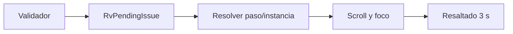
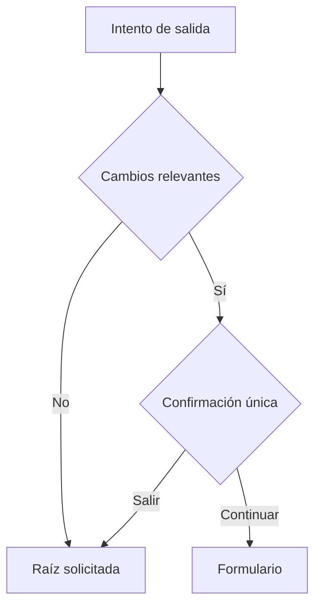
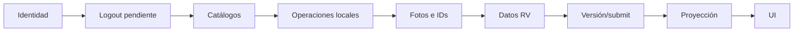
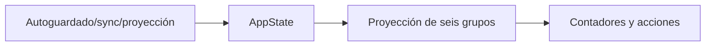
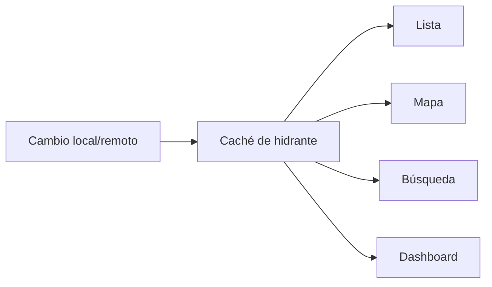
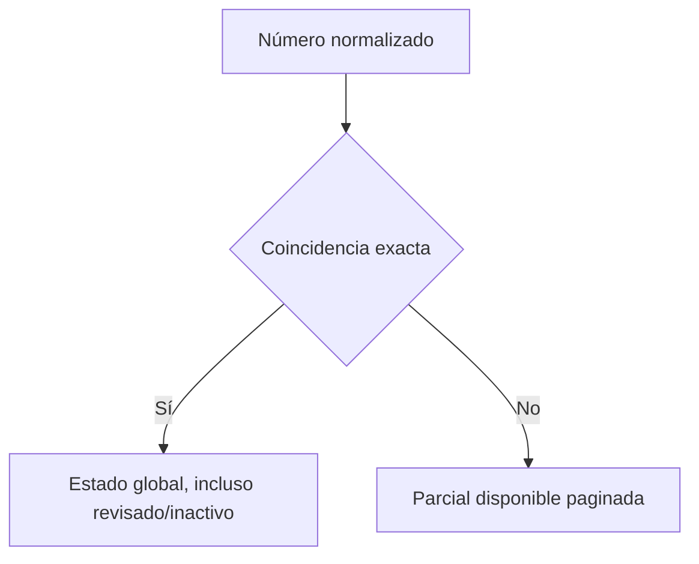

# Etapas 10–15 — Endurecimiento operativo móvil RV

## 1. Flujo de pendientes

`RvPendingIssue` unifica código, severidad, paso, sección, ítem, componente, instancia, slot y llave de foco. El validador omite dependencias inactivas. Resumen persiste el destino, el formulario restaura el paso, desplaza al `GlobalKey`, enfoca cuando el control lo admite y aplica borde/fondo semántico durante tres segundos. GPS, señal y fotos obligatorias apuntan al paso de captura; parcelarias conservan índice e instancia. La API devuelve `stepId` y `focusKey` además de metadatos de dominio.

## 2. Navegación y protección de borradores

Inicio e Hidrantes usan la raíz canónica de cada rama. La navegación inferior abandona stacks internos con `initialLocation`. Si hay cambios RV relevantes, Home/Hidrantes/Mapa/Perfil y Atrás usan una única confirmación: los avances ya están guardados, Salir no cancela. `openOrCreate` conserva un borrador por hidrante/ronda y restaura paso, respuestas, fotos y destino sin abrir teclado o cámara.

## 3. Eliminación de Cancelar

Flutter no contiene botón, diálogo, método de coordinador ni llamada `/cancel`. Salir sólo abandona temporalmente. La API conserva compatibilidad exclusivamente en `POST /admin/inspections/{id}/cancel`, protegida por token administrativo y rol admin/supervisor.

## 4. Orquestador y DAG

`AppState.synchronize` es la entrada global. Una ejecución activa comparte el mismo `Future`. El orden explícito es: identidad/conectividad → logout pendiente → catálogos → operaciones manuales → inspecciones (creación, fotos, reconciliación, respuestas, parcelarias, GPS, señal, versión/submit/complementos) → proyección/lista/mapa → indicadores. Cada inspección mantiene idempotencia y backoff propios; un resultado terminal no bloquea las demás.

Estados visibles: esperando conexión, preparando, catálogos, reportes, proyecciones, completado y completado con advertencias. Progreso usa elementos completados/total, advertencias, conflictos, hidrante y etapa; no inventa porcentajes.

## 5. Reintentos y restauración

El coordinador conserva `nextRetryAt`, backoff 5/15/45 s y errores deterministas. Conflictos de oficialidad/edición salen de reintento. La cola y borradores Hive sobreviven al reinicio. La reconexión y login disparan una ejecución segura si hay pendientes.

## 6. Dashboard móvil

Seis grupos estables: En proceso, Pendientes de sincronizar, Enviados, Validados, Devueltos y Conflictos. La proyección traduce estados locales/remotos sin mostrar códigos técnicos. Las tarjetas omiten localidad/municipio y usan fecha canónica. Los contadores se derivan del caché y se actualizan con `notifyListeners`.

## 7. Lista, mapa y búsqueda

La captura nueva sólo lista activos disponibles, salvo coincidencia exacta o trabajo local propio. La búsqueda exacta conserva ceros y guiones y abre reporte/estado global; la parcial prioriza disponibles. Lista, mapa, detalle y snapshot consumen `rv.hydrant_rv_status`.

Precedencia del mapa: conflicto/devuelto rojo → inactivo/no disponible gris → trabajo local ámbar → oficial verificado verde → disponible azul. La leyenda expone texto para los cinco estados.

## 8. Rendimiento

Bootstrap pinta Flutter antes de servicios remotos. El catálogo local abre inmediatamente; snapshots y mapa usan caché, cursor, bounds, índice espacial y carga incremental. Login no espera el catálogo completo. La sincronización de proyección se ejecuta después del trabajo local.

## 9. Pruebas y riesgos

Se prueban modelo navegable, eliminación de cancelación móvil, ejecución única, seis grupos, precedencia y leyenda del mapa, búsqueda exacta, proyección compartida y regresión acumulada. Riesgos restantes: concurrencia real SQL, conectividad móvil adversa y smoke tests de navegación/cámara.

## 10. Despliegue pendiente

No se requirió migración SQL nueva: las estructuras acumuladas cubren estados, colas y proyección. Despliegue futuro: respaldo, migraciones 01–09 en orden documentado, API, smoke contractual y app.

